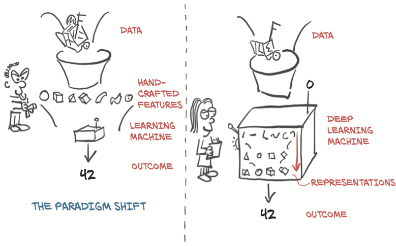

# 
1.深度学习和PyTorch库简介

***
>本章包括：  
&emsp;&emsp;- 深度学习如何改变我们的机器学习方法  
&emsp;&emsp;- 理解为什么Pythorch适合深度学习  
&emsp;&emsp;- 检查典型的深度学习项目  
&emsp;&emsp;- 您需要遵循的硬件以及示例  

&emsp;&emsp;<i><b>人工智能</b></i>这个定义不明确的术语涵盖了一系列学科，这些学科大量的研究、审查、混淆、幻想炒作和科幻恐惧症的影响。当然，现实要乐观得多。如果断言今天的机器正在学习任何人类意义上的“思考(think)”，这是不真实的。相反，我们已经发现了一类通用的算法，它们能够非常、非常有效地逼近复杂的、非线性的过程，我们可以用它们来自动执行以前仅限于人类完成的任务。  

&emsp;&emsp;例如，在 https://inferkit.com/ 上有一种称为**GPT-2**的语言模型可以一次生成一个单词的连贯文本段落。当我们把这一段写进去时，它产生了以下内容：
>接下来，我们要从电子邮件地址的语料库中输入一个短语列表，看看程序是否能将这些列表解析为句子。同样，这比本篇文章开头的搜索要复杂得多,但希望能帮助您理解用各种编程语言构建句子结构的基础知识。

即使在杂乱无章的背后没有一个明确的主题,对于一台机器来说，这是非常连贯的。

更令人印象深刻的是，执行这些以前只有人类才能完成的任务的能力是“通过示例”获得的，而不是由人类编写一套手工制作的规则。在某种程度上，我们逐步认识到，智能是一个我们经常与自我意识混为一谈的概念，而自我意识绝对不是成功完成这类任务所必需的。归根结底，计算机智能的问题可能根本不重要。Edsger W. Dijkstra发现，机器是否能思考的问题 "和潜艇是否会游泳的问题本质上相关。”[1](#jump1-1)

我们正在讨论的这类算法属于深度学习的人工智能(AI)子类别，它通过提供有启发性的例子来训练名为深度神经网络的数学实体。深度学习使用大量数据来近似输入和输出相距甚远的复杂函数，例如输入是一张图像，而输出则是描述输入的一行文本；或者使用手写的文稿作为输入，用自然的声音朗诵这串文本作为输出；或者，更简单的是，将一只金毛犬的图像与一个标志联系起来，告诉我们 "是的，有一只金毛犬存在"。这种能力使我们能够创建具有直到最近还是人类专有领域的功能的程序。

## 1.1 深度学习革命

&emsp;&emsp;为了领会这种深度学习方法所带来的范式转变，让我们回过头来看一看。直到过去十年，归于**机器学习**标签下的更广泛的一类系统都严重依赖于**特征工程**。特征是对输入数据的转换，便于下游算法（如分类器）在新数据上产生正确的结果。特征工程包括提出正确的变换，以便下游算法能够解决任务。例如，为了区分手写数字图像中的1和0，我们会想出一组滤波器来估计图像上的边缘方向，然后训练分类器来预测给定边缘方向分布的正确数字。另一个有用的特征可能是封闭的孔洞的数量，如在0、8，特别是环状2(loopy twos)中看到的。

&emsp;&emsp;另一方面，深度学习处理自动地从原始数据中找到这样的表征，以便成功地执行任务。在1对0的示例中，过滤器将在训练期间通过迭代查看成对的示例和目标标签来完善。这并不是说特征工程不适合深度学习，我们经常需要在学习系统中注入某种形式的先验知识。然而，神经网络通过摄取数据并根据示例提取有用的表征的能力是深度学习如此强大的原因。深度学习从业者的重点不是手工制作这些表征，而是对数学实体进行操作，使其自主地从训练数据中发现表征。通常，这些自动创建的特征比手工创建的特征更好！与许多颠覆性技术一样，这一事实导致了观点的改变。

&emsp;&emsp;在图1.1的左侧，我们看到从业者忙着定义工程特征，并将其反馈给学习算法；任务上的结果将和从业者工程上选择的特征一样好。在右侧，通过深度学习，将原始数据反馈给算法，在自身任务性能优化的引导下，自动提取层次化特征；任务的结果将和从业者推动算法朝着目标前进的能力一样好。

图1.1 深度学习交换了手工制作功能的需求，以满足数据和计算需求的增加

从图1.1的右侧开始，我们已经瞥见了执行成功的深度学习所需的条件：

* 我们需要一种方法来提取我们手头的任何数据。
* 我们需要以某种方式定义深度学习机器。
* 我们必须有一种自动化的方式，**训练**，以获得有用的表征，并使机器产生期望的输出。

&emsp;&emsp;这让我们不得不仔细考虑我们一直在说的**训练**这件事。在训练过程中，我们使用一个**标准**，即模型输出和参考数据的实值函数，为我们模型的期望输出和实际输出之间的差异提供一个数值分数（按照惯例，分数越低通常越好）。训练包括通过逐步修改我们的深度学习机器来推动标准向更低的分数发展，直到它达到低分，即使是在训练期间没有看到的数据上也是如此。

##  1.2 深度学习：PyTorch

---
 1 Edsger W. Dijkstra, “The Threats to Computing Science,” http://mng.bz/nPJ5.
