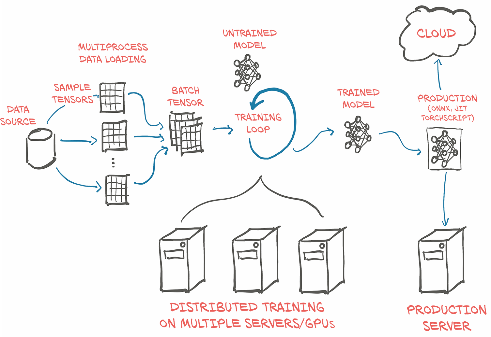

# 
1. 深度学习和PyTorch库简介

***
>本章包括：  
&emsp;&emsp;- 深度学习如何改变我们的机器学习方法  
&emsp;&emsp;- 理解为什么Pythorch适合深度学习  
&emsp;&emsp;- 检查典型的深度学习项目  
&emsp;&emsp;- 您需要遵循的硬件以及示例  

&emsp;&emsp;<i><b>人工智能</b></i>这个定义不明确的术语涵盖了一系列学科，这些学科大量的研究、审查、混淆、幻想炒作和科幻恐惧症的影响。当然，现实要乐观得多。如果断言今天的机器正在学习任何人类意义上的“思考(think)”，这是不真实的。相反，我们已经发现了一类通用的算法，它们能够非常、非常有效地逼近复杂的、非线性的过程，我们可以用它们来自动执行以前仅限于人类完成的任务。  

&emsp;&emsp;例如，在 https://inferkit.com/ 上有一种称为**GPT-2**的语言模型可以一次生成一个单词的连贯文本段落。当我们把这一段写进去时，它产生了以下内容：
>接下来，我们要从电子邮件地址的语料库中输入一个短语列表，看看程序是否能将这些列表解析为句子。同样，这比本篇文章开头的搜索要复杂得多,但希望能帮助您理解用各种编程语言构建句子结构的基础知识。

即使在杂乱无章的背后没有一个明确的主题,对于一台机器来说，这是非常连贯的。

更令人印象深刻的是，执行这些以前只有人类才能完成的任务的能力是“通过示例”获得的，而不是由人类编写一套手工制作的规则。在某种程度上，我们逐步认识到，智能是一个我们经常与自我意识混为一谈的概念，而自我意识绝对不是成功完成这类任务所必需的。归根结底，计算机智能的问题可能根本不重要。Edsger W. Dijkstra发现，机器是否能思考的问题 "和潜艇是否会游泳的问题本质上相关。”[1](#jump1-1)

我们正在讨论的这类算法属于深度学习的人工智能(AI)子类别，它通过提供有启发性的例子来训练名为深度神经网络的数学实体。深度学习使用大量数据来近似输入和输出相距甚远的复杂函数，例如输入是一张图像，而输出则是描述输入的一行文本；或者使用手写的文稿作为输入，用自然的声音朗诵这串文本作为输出；或者，更简单的是，将一只金毛犬的图像与一个标志联系起来，告诉我们 "是的，有一只金毛犬存在"。这种能力使我们能够创建具有直到最近还是人类专有领域的功能的程序。

## 1.1 深度学习革命

&emsp;&emsp;为了领会这种深度学习方法所带来的范式转变，让我们回过头来看一看。直到过去十年，归于**机器学习**标签下的更广泛的一类系统都严重依赖于**特征工程**。特征是对输入数据的转换，便于下游算法（如分类器）在新数据上产生正确的结果。特征工程包括提出正确的变换，以便下游算法能够解决任务。例如，为了区分手写数字图像中的1和0，我们会想出一组滤波器来估计图像上的边缘方向，然后训练分类器来预测给定边缘方向分布的正确数字。另一个有用的特征可能是封闭的孔洞的数量，如在0、8，特别是环状2(loopy twos)中看到的。

&emsp;&emsp;另一方面，深度学习处理自动地从原始数据中找到这样的表征，以便成功地执行任务。在1对0的示例中，过滤器将在训练期间通过迭代查看成对的示例和目标标签来完善。这并不是说特征工程不适合深度学习，我们经常需要在学习系统中注入某种形式的先验知识。然而，神经网络通过摄取数据并根据示例提取有用的表征的能力是深度学习如此强大的原因。深度学习从业者的重点不是手工制作这些表征，而是对数学实体进行操作，使其自主地从训练数据中发现表征。通常，这些自动创建的特征比手工创建的特征更好！与许多颠覆性技术一样，这一事实导致了观点的改变。

&emsp;&emsp;在图1.1的左侧，我们看到从业者忙着定义工程特征，并将其反馈给学习算法；任务上的结果将和从业者工程上选择的特征一样好。在右侧，通过深度学习，将原始数据反馈给算法，在自身任务性能优化的引导下，自动提取层次化特征；任务的结果将和从业者推动算法朝着目标前进的能力一样好。

图1.1 深度学习交换了手工制作功能的需求，以满足数据和计算需求的增加

从图1.1的右侧开始，我们已经瞥见了执行成功的深度学习所需的条件：

* 我们需要一种方法来提取我们手头的任何数据。
* 我们需要以某种方式定义深度学习机器。
* 我们必须有一种自动化的方式，**训练**，以获得有用的表征，并使机器产生期望的输出。

&emsp;&emsp;这让我们不得不仔细考虑我们一直在说的**训练**这件事。在训练过程中，我们使用一个**标准**，即模型输出和参考数据的实值函数，为我们模型的期望输出和实际输出之间的差异提供一个数值分数（按照惯例，分数越低通常越好）。训练包括通过逐步修改我们的深度学习机器来推动标准向更低的分数发展，直到它达到低分，即使是在训练期间没有看到的数据上也是如此。

##  1.2 深度学习：PyTorch

&emsp;&emsp;PyTorch是一个Python程序库，有助于构建深度学习项目。它强调灵活性，允许采用习惯性的Python表达深度学习模型。这种亲和力和易用性在研究社区中找到了早期的采用者，自首次发布以来的几年中，它横跨广泛的应用领域，已经成长为最突出的深度学习工具之一。

&emsp;&emsp;正如Python对编程的作用一样，PyTorch提供了一个很好的深度学习入门。同时，事实证明，PyTorch完全有资格在专业背景下用于真实世界的高精尖工作。我们相信，PyTorch清晰的语法、精简的API和易于调试使其成为引进深度学习的绝佳选择。我们强烈建议学习PyTorch作为您的第一个深度学习库。至于它是否应该成为您学习的最后一个深度学习库，将由您自己决定。

&emsp;&emsp;事实上，图1.1中的深度学习机的核心是一个将输入映射到输出的相当复杂的数学函数。为了便于表达此函数，PyTorch提供了核心数据结构-**张量**，它是一个多维数组，与NumPy数组有许多相似之处。围绕这一基础，PyTorch提供了在专用硬件上执行加速数学运算的功能，这使得设计神经网络结构并在单机或并行计算资源上进行训练变得非常方便。

&emsp;&emsp;本书旨在为软件工程师、数据科学家和熟练掌握Python的学生提供一个起点，让他们能够自如地使用PyTorch来构建深度学习项目。我们希望本书尽可能地通俗易懂和实用，我们希望您能够将本书中的概念应用到其他领域。为此，我们采用了实践的方法，并鼓励您随时准备好您的计算机，这样您就可以使用这些示例，并将它们进一步推广。当我们读完本书的时候，我们希望您能够在优秀的官方文档的支持下，利用一个数据源，构建出一个深度学习项目。

&emsp;&emsp;尽管我们强调使用PyTorch构建深度学习系统的实用性，但我们相信，提供一个易懂的基础深度学习工具的介绍，不仅仅是为了促进新技术技能的获得，更是为了让来自广泛学科的新一代科学家、工程师和从业人员掌握工作知识，在未来几十年内成为许多软件项目的支柱。

&emsp;&emsp;为了充分利用这本书，您需要准备两样东西：
  * 有一定的Python编程经验。我们不打算在这一点上做任何尝试；您需要掌握Python数据类型、类、浮点数字等。
  * 愿意深入研究并动手操作。我们将从基础知识开始，积累我们的工作知识。如果您能跟着我们一起学习，您将会轻松很多。

&emsp;&emsp;《深度学习与PyTorch》分为三个不同的部分。第1部分涵盖了基础知识，详细研究了PyTorch提供的设施，以便通过代码将图1.1中的深度学习框架付诸实施。第2部分将引导您完成一个涉及医学成像的端到端项目：在CT扫描中查找肿瘤并对其进行分类，在第1部分介绍的基本概念基础构建，并添加更高级的主题。简短的第3部分以了解PyTorch为将深度学习模型部署到生产中所提供的功能来结束本书。

&emsp;&emsp;深度学习是一个巨大的领域。在本书中，我们将介绍该领域中的一小部分：具体来说，利用常见于图像处理的2D和3D数据集，采纳PyTorch实现较小范围的分类和分割项目。本书专注于实用的PyTorch，目的是涵盖足够多的领域，让您能够用深度学习解决现实世界的机器学习问题，例如在视觉领域，或者探索研究文献中出现的新模型。与深度学习研究相关的大部分（如果不是全部）最新出版物都可以在arXiV公共预印本库中找到，该库托管在 https://arxiv.org. [2](#jump1-2)

##  1.3 为什么使用深度学习

&emsp;&emsp;正如我们已经说过的，深度学习允许我们通过将我们的模型暴露在说明性的例子中，来执行非常广泛的复杂任务，比如机器翻译、玩策略游戏或识别混乱场景中的对象。为了在实践中做到这一点，我们需要的工具必须是灵活的，以便它们能够适应如此广泛的问题，并且要高效，可以在合理的时间内对大量数据进行训练；而且我们需要训练后的模型在输入存在可变性的情况下正确执行。让我们来看看我们决定使用PyTorch的一些原因。

&emsp;&emsp;PyTorch很容易被推荐，因为它非常简单。许多研究人员和从业人员发现它易于学习、使用、扩展和调试。它是Python式的，虽然像任何复杂的领域一样，它也有注意事项和最佳实践，但使用该库一般会让之前使用过Python的开发者感到熟悉。

&emsp;&emsp;更具体地说，在PyTorch中编写深度学习机是非常自然的。PyTorch为我们提供了一种数据类型，**张量(Tensor)**，通常用于保存数字、向量、矩阵或数组。此外，它还提供了对它们进行操作的函数。我们可以使用它们进行增量编程，如果需要，还可以进行交互式编程，就像我们在Python中习惯的那样。如果您了解NumPy，这将非常熟悉。

&emsp;&emsp;然而，PyTorch提供了两点使其与深度学习特别相关的东西：第一，它使用图形处理单元(GPU)提供加速计算，通常比在CPU上进行相同的计算提速50倍。其次，PyTorch提供了支持对通用数学表达式进行数值优化的设施，而深度学习将使用这些表达式进行训练。请注意，这两个功能一般都适用于科学计算，而不仅仅专用于深度学习。事实上，我们可以放心地将PyTorch定性为一个在Python中为科学计算提供优化支持的高性能库。

&emsp;&emsp;PyTorch的一个设计驱动因素是表现力，它允许开发人员实现复杂的模型，而不会被库强加过多的复杂性(它不是一个框架！)。PyTorch可以说是深度学习领域中最能将想法无缝翻译成Python代码的库之一。出于这个原因，PyTorch 在研究中得到了广泛的采用，这一点从国际会议上的高引用率就可以看出[3](#jump1-3)。

&emsp;&emsp;PyTorch也有一段从研究和开发过渡到生产的令人信服的历史。虽然PyTorch最初专注于研究工作流，但它已经配备了高性能的C++ runtime，可以不依赖Python部署模型进行推理，并可用于用C++设计和训练模型。它还增加了与其他语言的绑定，以及用于部署到移动设备的接口。这些功能使我们能够利用PyTorch的灵活性，并将其引入到了难以获得完整的Python runtime或开销昂贵的应用程序中。

&emsp;&emsp;当然，声称易用性和高性能是微不足道的。我们希望，当您读完这本书的时候，您会同意我们的说法，我们在这里的说法是有根据的。

### 1.3.1 深度学习竞争格局

&emsp;&emsp;虽然所有的类比都是有缺陷的，但2017年1月PyTorch 0.1的发布似乎标志着深度学习库、包装器和数据交换格式从寒武纪爆炸式的扩散过渡到了一个整合和统一的时代。

>注  
最近，深度学习领域的发展非常迅速，当您读到这篇印刷品的时候，它很可能已经过时了。如果您不熟悉这里提到的一些库，那也没关系。

在PyTorch的第一个测试版发布时：

* Theano和TensorFlow是首屈一指的底层库，它的工作模式是让用户定义一个计算图，然后执行它。
* Lasagne和Keras是围绕Theano的高级封装器，Keras也封装了TensorFlow和CNTK
* Caffe、Chainer、DyNet、Torch（基于Lua的PyTorch的前身）、MXNet、CNTK、DL4J等填补了生态系统中的各种空缺。

在随后的大约两年时间里，格局发生了巨大的变化。社区基本上巩固了PyTorch或TensorFlow的地位，除了那些填补特定市场的库之外，其他库的采用率也在减少。简而言之：

* Theano，最早的深度学习框架之一，已经停止了主动开发。
* TensorFlow：
   - 完全融合了Keras，将其提升为一流的API 
   - 提供了一个即时执行的 "eager mode"，这与PyTorch处理计算的方式有些相似 
   - 发布了默认采用eager mode的TF 2.0
* JAX，是Google开发的一个独立于TensorFlow的库，作为一个与NumPy对等的库，具有GPU、autograd和JIT功能，它已经开始获得吸引力。
* PyTorch：
  - 使用Caffe2作为后端
  - 替换了大部分从基于Lua的Torch项目中重用的低级代码
  - 增加了对ONNX的支持，ONNX是一种厂商中立的模型描述和交换格式
  - 增加了一个延迟执行的 "graph mode "runtime，称为TorchScript
  - 发布了1.0版本
  - 取代了CNTK和Chainer，成为各自公司赞助商选择的框架

TensorFlow拥有强大的生产渠道、广泛的行业社区和巨大的市场份额。由于其易用性，PyTorch在研究和教学界取得了巨大的进展，自那以来，随着研究人员和毕业生培训学生并转向工业界，PyTorch的发展势头有所增强。在生产解决方案方面，它也积累了动力。有趣的是，随着TorchScript和eager mode的出现，PyTorch和TensorFlow的功能集都开始与对方的功能集趋于一致，尽管这些功能的呈现方式和整体体验仍然有很大的不同。

##  1.4 概述PyTorch如何支持深度学习项目

&emsp;&emsp;我们已经提到了PyTorch中的一些组件。现在，让我们花点时间来正式确定一下构成PyTorch的主要组件的高级地图。我们可以通过观察深度学习项目需要从PyTorch中获得什么来实现这一目标。

&emsp;&emsp;首先，PyTorch的"Py"和Python一样，但里面有很多非Python的代码。实际上，出于性能考虑，PyTorch的大部分代码是用C++和CUDA (https://www.geforce.com/hardware/technology/cuda) 编写的，CUDA是NVIDIA的一种类似于C++的语言，经过编译后可以在GPU上大规模并行运行。有一些方法可以直接从C++中运行PyTorch，我们将在第15章中研究这些方法。这种能力的动机之一是为在生产中部署模型提供可靠的策略。然而，大多数时候，我们会从Python中与PyTorch进行交互，构建模型、训练模型，并使用训练后的模型来解决实际问题。

&emsp;&emsp;事实上，Python API是PyTorch在可用性和与更广泛的Python生态系统集成方面的亮点。让我们来看看PyTorch的心理模型。

&emsp;&emsp;正如我们已经提到的，PyTorch的核心是一个提供多维数组的库，也就是 PyTorch的术语中的 `tensors`（张量，我们将在第3章中详细介绍），以及由 `torch `模块提供的关于它们的大量操作库。`tensors` 和对它们的操作都可以在 CPU 或 GPU 上使用。在PyTorch中，将计算从CPU转移到GPU上，所需要的不过是一两个额外的函数调用。PyTorch 提供的第二项核心功能是，能够让`tensors`跟踪对其执行的操作，并分析计算输出相对于任何输入的导数。这是用于数值优化的，而且是由 `tensors`通过PyTorch库下的 `autograd` 引擎调度而原生提供的。

&emsp;&emsp;通过拥有张量和支持自动梯度的张量标准库，PyTorch可以用于物理、渲染、优化、模拟、建模等-我们很有可能在整个科学应用领域看到PyTorch以创造性的方式被使用。但PyTorch首先是一个深度学习库，因此它提供了构建和训练神经网络所需的所有构件。图1.2显示了加载数据、训练模型，然后将该模型部署到生产环境中的标准设置。

&emsp;&emsp;构建神经网络的核心PyTorch模块位于`torch.nn`中，它提供了常见的神经网络层和其他架构组件。全连接层、卷积层、激活函数和损失函数都可以在这里找到（我们将在本书的其他部分详细介绍这些内容的含义）。这些组件可以用来建立和初始化我们在图1.2中心看到的未经训练的模型。为了训练我们的模型，我们需要一些额外的东西：训练数据源、使模型适应训练数据的优化器，以及将模型和数据送到实际执行训练模型所需计算的硬件的方法。

图1.2 PyTorch项目的基本、高级结构，包括数据加载、培训和部署到生产

&emsp;&emsp;在图1.2左侧，我们看到，在训练数据到达我们的模型之前，需要进行相当多的数据处理[4](#jump1-4)。首先，物理获取数据，通常是从某种类型的存储中获取数据作为数据源。然后，我们需要将数据中的每个样本转换为PyTorch能够实际处理的东西：tensors(张量)。在我们的自定义数据（无论其格式如何）和标准化的 PyTorch 张量之间的桥梁就是 `torch.utils.data` 中 PyTorch 提供的 `Dataset` 类。由于这个过程在不同的问题上有很大的差异，所以我们必须自己实现这个数据源。我们将在第4章中详细研究如何将我们可能要处理的各种类型的数据表示为张量。

&emsp;&emsp;由于数据存储往往很慢，特别是由于访问延迟，我们希望能实现数据加载的并行化。但由于Python诸多优点并不包括简单、高效、并行处理，因此我们将需要多个进程来加载我们的数据，以便将它们组装成`batches`批处理：包含多个样本的张量。这相当复杂；但由于它也比较通用，PyTorch在`DataLoader`类中很容易地提供了所有这些。它的实例可以派生生子进程，以便在后台从数据集中加载数据，这样，只要训练循环能够使用它，它就可以准备好并等待训练循环。我们将在第7章认识和使用`Dataset`和`DataLoader`。

&emsp;&emsp;有了获取批量样本的机制，我们可以转向图1.2中心的训练循环本身。通常情况下，训练循环是作为一个标准的Python `for`循环来实现的。在最简单的情况下，模型在本地CPU或单个GPU上运行所需的计算，一旦训练循环有了数据，计算就可以立即开始。这有可能是你的基本设置，这也是我们在本书中假设的设置。

&emsp;&emsp;在训练循环的每一步，我们都会根据从数据加载器获得的样本来评估我们的模型。然后，我们使用某种**标准**或**损失函数**将模型的输出与预期输出（目标）进行比较。正如它提供了用于构建模型的组件一样，PyTorch也有各种损失函数供我们使用。它们也在 `torch.nn` 中提供。在将我们的实际输出与具有损失函数的理想输出进行比较之后，我们需要稍微改动模型，使其输出更接近目标值。如前所述，这就是 `PyTorch autograd` 引擎的作用；但我们还需要一个**优化器**来进行更新，这就是 PyTorch 在 `torch.optim` 中为我们提供的功能。我们将在第5章中开始研究使用损失函数和优化器的训练循环，然后在第6章到第8章中磨练我们的技能，最后再着手进行第2部分的大项目。

&emsp;&emsp;使用更复杂的硬件越来越常见，比如多个GPU或多台机器为训练一个大型模型共同贡献自己的资源，如图1.2底部中心所示。在这些情况下，可以采用 `torch.nn.parallel.Distributed-DataParallel` 和 `torch.distributed` 子模块来使用额外的硬件。

&emsp;&emsp;训练循环可能是深度学习项目中最乏味却最耗时的部分。在它结束时，我们得到的回报是一个模型，它的参数已经在我们的任务上得到了优化：图中训练循环右边描绘的**训练模型**。有一个模型来解决任务是很好的，但为了让它有用，我们必须把它放在需要工作的地方。这个过程中的部署部分，如图1.2中右侧描绘，可能涉及将模型放在服务器上，或者导出模型加载到云引擎。或者我们可能会将其与一个更大的应用程序集成，或者在手机上运行。

&emsp;&emsp;部署实践的一个特定步骤可以是导出模型。如前所述，PyTorch默认为立即执行模型（EAGER模式）。每当涉及PyTorch的指令被Python解释器执行时，相应的操作就会被底层的C++或CUDA实现立即执行。随着对 tensors 进行操作的指令增多，后端实现会执行更多的操作。

PyTorch还提供了一种通过TorchScript提前编译模型的方法。
使用TorchScript，PyTorch可以将模型序列化为一组指令，这些指令可以独立于Python调用：比方说，从C++程序或在移动设备上调用。
我们可以将其视为具有特定于张量操作的有限指令集的虚拟机。
这允许我们将模型导出为与PyTorch运行时一起使用的TorchScript，或者以称为ONNX的标准化格式导出。
这些功能是PyTorch生产部署功能的基础。
我们将在第15章中讨论这一点。

PyTorch 还提供了一种通过 `TorchScript` 提前编译模型的方法。使用TorchScript，PyTorch可以将模型序列化为一套独立于Python调用的指令：比如说，从C++程序或移动设备上调用。我们可以将其视为具有特定于张量操作的有限指令集的虚拟机。这使得我们可以将模型导出，或者作为`TorchScript`与`PyTorch runtime`一起使用，或者以名为`ONNX`的标准化格式导出。这些功能是 PyTorch 生产部署能力的基础。我们将在第 15 章中介绍这一点。

##  1.5 硬件和软件要求

&emsp;&emsp;本书需要对涉及大量数值计算的任务进行编程和运行，如大量矩阵的乘法。事实证明，在新的数据上运行一个预先训练好的网络，是任何一台最新的笔记本电脑或个人计算机都能做到的。即使是采用预训练的网络，并对其中的一小部分进行再训练，使其在新的数据集上专业化，也不一定需要专门的硬件。你可以使用标准的个人计算机或笔记本电脑来跟进我们在本书第1部分所做的一切。

&emsp;&emsp;然而，我们预计，完成第2部分中更高级的示例的完整训练运行将需要一个支持CUDA的GPU。第2部分中使用的默认参数假设GPU的内存为8 GB（我们建议使用NVIDIA GTX 1070或更高版本），但如果你的硬件可用内存较少，这些参数可以调整。需要说明的是：如果你愿意等待，这样的硬件并不是必须的，但在GPU上运行至少可以将训练时间缩短一个数量级（通常会快40-50倍）。单独来看，计算参数更新所需的操作在现代硬件上（从几分之一秒到几秒）是很快的，比如典型的笔记本电脑CPU。问题在于，训练涉及反复、多次地运行这些操，增量更新网络参数，以最小化训练误差。

&emsp;&emsp;中等规模的网络在配备好GPU的工作站上从头开始训练大型真实世界的数据集可能需要数小时到数天的时间。通过在同一台机器上使用多个GPU，甚至在配备多个GPU的机器集群使用多个GPU，可以进一步缩短这一时间。多亏了云计算提供商提供的服务，这些配置并不像听起来那样令人望而却步。DAWNBench (https://dawn.cs.stanford.edu/benchmark/index.html) 是斯坦福大学的一个有趣的计划，旨在提供与公开可用数据集上的常见深度学习任务相关的训练时间和云计算成本的基准。

&emsp;&emsp;因此，如果你在阅读至第2部分时，已经拥一个GPU，那就太好了。否则，我们建议查看各种云平台的产品，其中许多平台提供了支持GPU的Jupyter Notebooks，并预装了PyTorch，通常是有免费配额的。Google Colaboratory (https://colab.research.google.com) 是一个很好的开始。

&emsp;&emsp;最后一个考虑事项是操作系统(OS)。PyTorch从第一个版本开始就支持Linux和MacOS，并在2018年获得了Windows的支持。由于目前的苹果笔记本电脑不包括支持CUDA的GPU，因此PyTorch的预编译MacOS软件包仅适用于CPU。在整本书中，我们将尽量避免假设您正在运行特定的操作系统，尽管第2部分中的一些脚本似乎是从Linux下的Bash命令提示行运行的。这些脚本的命令行应该很容易转换为与Windows兼容的形式。为方便起见，在可能的情况下，代码将按照从Jupyter Notebook中运行的方式列出。

&emsp;&emsp;有关安装信息，请参见PyTorch官方网站 (https://pytorch.org/get-started/locally) 上的入门指南。我们建议Windows用户使用Anaconda或Miniconda (https://www.anaconda.com/distribution 或 https://docs.conda.io/en/latest/miniconda.html) 进行安装。其他操作系统(如Linux)通常具有更广泛的可用选项，`Pip` 是Python最常见的包管理器。我们提供了一个`requirements.txt`文件，pip可以使用该文件安装依赖项。当然，有经验的用户可以自由地以与您首选的开发环境最兼容的方式安装软件包。

&emsp;&emsp;第2部分也有一些不小的下载带宽和磁盘空间要求。第2部分中癌症检测项目所需的原始数据下载量约为60 GB，解压后需要约120 GB的空间。压缩后的数据可以在解压后删除。此外，出于性能考虑，要缓存部分数据，在训练时还需要80GB。你将需要在系统上准备总共200 GB（至少）的可用磁盘空间，用于训练。虽然可以使用网络存储，但如果网络访问速度慢于本地磁盘，则可能会有训练速度损失。你最好在本地SSD上有空间来存储数据，以便快速检索。

### 1.5.1 使用Jupyter Notebooks

&emsp;&emsp;我们将假设您已经安装了PyTorch和其他依赖项，并且已经验证了一切正常。前面我们提到了遵循本书中的代码的可能性。我们将在示例代码中大量使用`Jupyter Notebooks`。`Jupyter Notebook`在浏览器中显示为一个页面，我们可以通过它交互式地运行代码。代码由一个`kernel`（内核）进行评估，该`kernel`是一个运行在服务器上的进程，它随时准备接收代码执行并将结果发回，然后在页面上内联渲染。`notebook`将内核的状态和代码评估过程中定义的变量一样，维护在内存中，直到它被终止或重新启动。我们与`notebook`交互的基本单位是一个`cell`（单元格）：页面上的一个方框，我们可以在其中键入代码并让内核对其求值(通过菜单项或按Shift-Enter)。我们可以在一个`notebook`中添加多个`cell`，新的`cell`将可见我们在前面的`cell`中创建的变量。`cell`的最后一行返回的值在执行后会被打印在`cell`的正下方，绘图也是如此。通过混合源代码、评估结果和Markdown格式的文本单元格，我们可以生成漂亮的交互式文档。你可以在项目网站 (https://jupyter.org) 上阅读关于`Jupyter Notebooks`的所有内容。

&emsp;&emsp;此时，您需要从GitHub的代码签出的根目录启动`notebook`服务器。具体如何启动服务器取决于你的操作系统的细节，以及你安装Jupyter的方式和位置。如果您有任何问题，欢迎在本书的论坛上提问。5启动后，您的默认浏览器将弹出，显示本地笔记本文件的列表。

&emsp;&emsp;这时，你需要从GitHub的代码签出的根目录下启动笔记本服务器。具体如何启动服务器取决于你的操作系统的细节，以及你安装Jupyter的方式和地点。如果你有问题，欢迎在本书的论坛上提问[5](#jump1-5)。启动后，你的默认浏览器会弹出，显示本地笔记本文件的列表。

>注
Jupyter Notebooks是通过代码表达和研究想法的强大工具。虽然我们认为它们非常适合我们这本书的用例，但它们并不适合每个人。我们认为,专注于消除摩擦和最小化认知开销是很重要的，这对每个人来说都是不同的。在使用PyTorch进行试验期间，你可以随意使用。

&emsp;&emsp;书中所有列表的完整工作代码可以在本书的网站 (https://www.manning.com/books/deep-learning-with-pytorch) 和我们在GitHub上的存储库 (https://github.com/deep-learning-with-pytorch/dlwpt-code) 中找到。

##  1.6 练习

1. 启动Python，以获得交互式提示窗口。
    1. 您使用的是什么Python版本？我们希望至少是3.6！
    2. 您能`import torch`吗？您得到的是什么版本的PyTorch？
    3. `torch.cuda.is_available()`的结果是什么？根据您使用的硬件，它是否符合您的预期？
2. 启动Jupyter notebook server。
    1. Jupyter使用的是什么版本的Python？
    2. Jupyter使用的`torch`库的位置与您从交互提示符导入的位置相同吗？

##  1.7 小结

* 深度学习模型会自动学习从实例中关联输入和期望的输出。
* 像PyTorch这样的库可以让您高效地构建和训练神经网络模型。
* PyTorch最大限度地减少了认知开销，同时注重灵活性和速度。它还默认为立即执行操作。
* TorchScript允许我们预编译模型，不仅可以从Python中调用它们，还可以从C++程序和移动设备上调用它们。
* 自2017年初发布PyTorch以来，深度学习工具生态系统已经明显巩固。
* PyTorch提供了许多实用程序库来促进深度学习项目。

---
 1 Edsger W. Dijkstra, “The Threats to Computing Science,” http://mng.bz/nPJ5.

2 我们还推荐[www.arxiv-sanity.com](www.arxiv-sanity.com)帮助组织感兴趣的研究论文。

3 在2019年国际学习表征会议（ICLR）上，PyTorch被252篇论文引用，高于上一年的87篇，与TensorFlow出现在266篇论文中的水平相同。

5 这只是即时完成的数据准备，而不是预处理，这在实际项目中可能是相当大的一部分。

5 https://forums.manning.com/forums/deep-learning-with-pytorch
