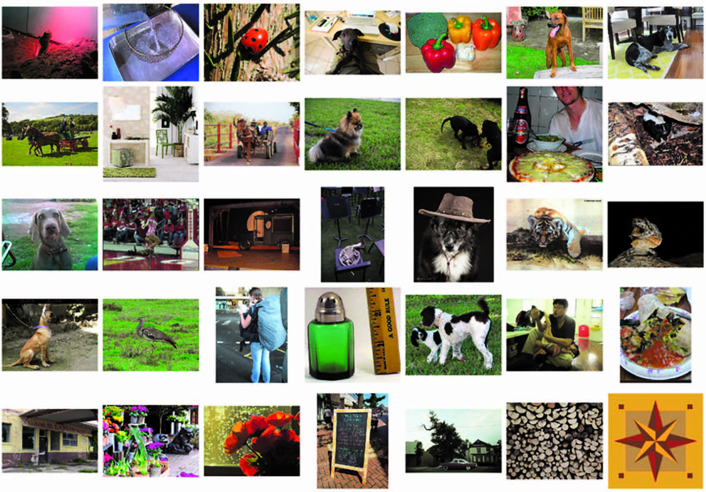
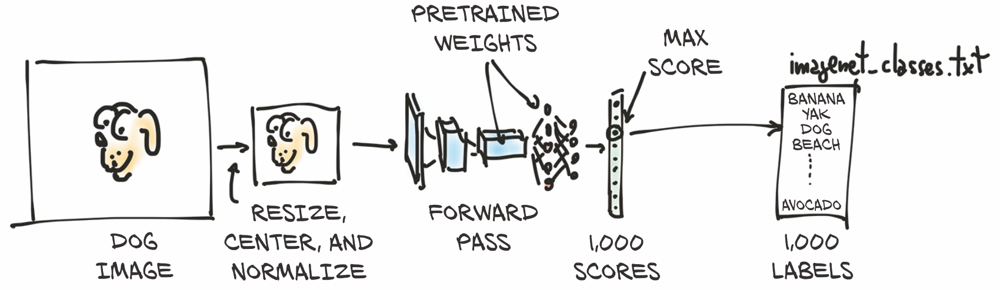
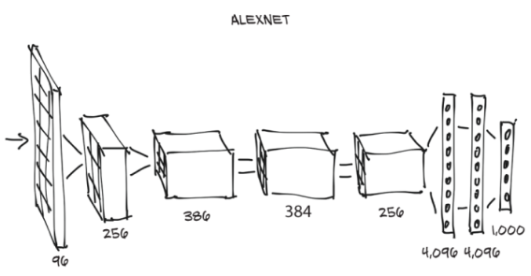
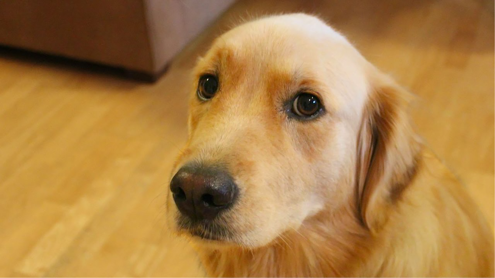
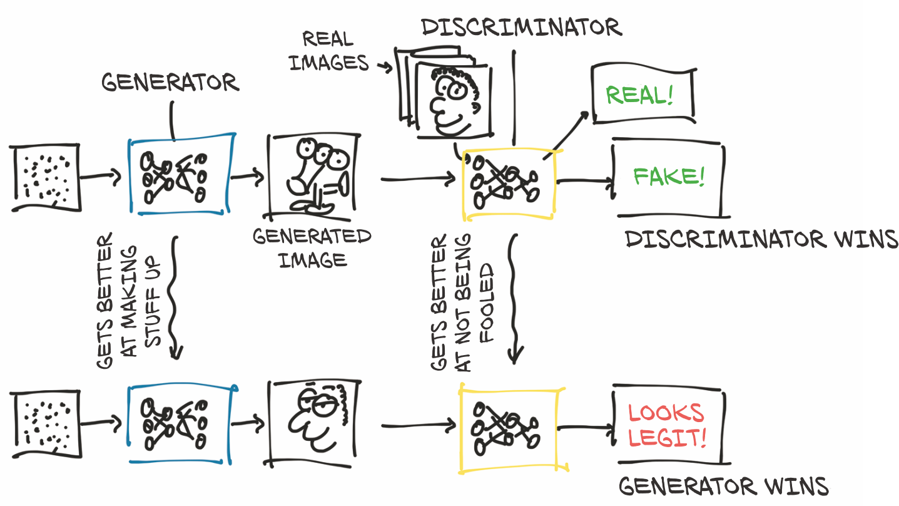
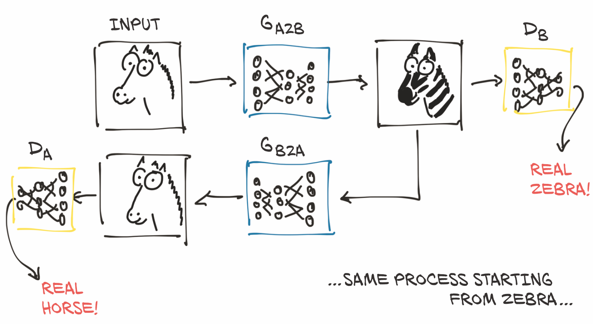
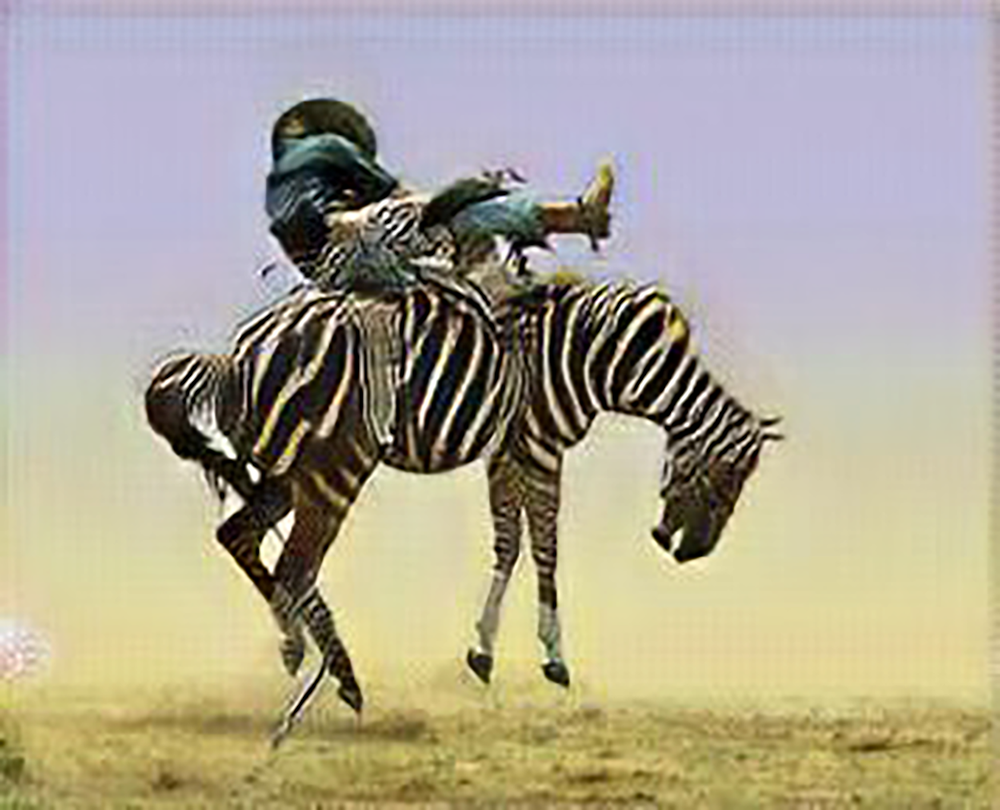
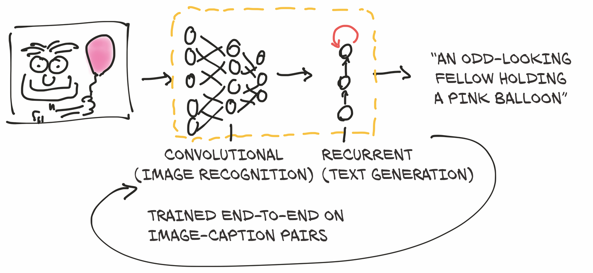

# <p align="right">2.预训练网络</p>
***

>本章包括：  
&emsp;&emsp;- 运行预训练的图像识别模型  
&emsp;&emsp;- GANs和CycleGAN的介绍  
&emsp;&emsp;- 可以产生图像文字描述的字幕模型  
&emsp;&emsp;- 通过Torch Hub共享模型  

我们在第一章结尾处承诺，将在这一章中揭开令人惊奇的事物，现在是时候兑现了。出于多种原因，计算机视觉无疑是受深度学习出现影响最大的领域之一。存在着对自然图像内容进行分类或解释的需求，非常大的数据集变得可用，卷积层等新的构造被发明出来，并且可以可以在GPU上以前所未有的精度快速运行。所有这些因素与互联网巨头们渴望了解由数百万用户使用其移动设备拍摄并在所述巨头平台上进行管理的照片这一事实相结合。一场完美的风暴终于降临。


我们将通过下载和运行非常有趣的模型来学习如何利用该领域最好的研究人员的工作，这些模型已经在开放的、大规模的数据集上进行了培训。我们可以把预训练的神经网络想象成类似于一个接受输入并产生输出的程序。这样的程序的行为由神经网络的体系结构以及在训练过程中看到的示例来决定，它们取决于所需的输入-输出对或输出应满足的所需属性。使用现成的模型可能是一种启动深度学习项目的快速方式，因为它借鉴了设计模型的研究人员的专业知识，以及训练权重所需的计算时间。

在这一章中，我们将探索三种流行的预训练模型：一种可以根据图像的内容对其进行标记的模型，另一种可以从真实图像生成新图像的模型，以及一个可以使用合适的英语句子描述图像内容的模型。
我们将学习如何在PyTorch中加载和运行这些预先训练模型，并且将介绍PyTorch Hub，这是一组工具，通过它们，可以通过统一的接口轻松地使用像我们将要讨论的那些模型。在此过程中，我们将讨论数据源，定义**标签**等术语，并参加一场“斑马竞技”。

如果您是从其他深度学习框架来学习PyTorch的，而且您更愿意直接跳到PyTorch的核心内容，则可以跳到下一章。本章中我们将涉及的内容更多的是趣味性而非基础性的，并且在一定程度上独立于任何特定的深度学习工具。这并不是说它们不重要! 但如果你已经在其他深度学习框架中使用过预训练的模型，那么你已经知道它们是多么强大的工具。而且，倘若你已经熟悉了生成式对抗网络（GAN）游戏，那你就更不需要我们向你解释了。

不过，我们希望你能继续阅读，因为本章在乐趣之下隐藏了一些重要的技能。学习如何使用 PyTorch 运行预训练的模型是一项有用的技能--这点完全没错。如果模型是在一个大型数据集上训练出来的，则特别有用。我们需要习惯于在真实世界的数据上获取和运行神经网络的机制，然后对其输出进行可视化和评估，无论我们是否对其进行了训练。

## 2.1 <span id='chap2-1'>一种可识别图像主体的预训练网络</span>

作为我们深度学习的首次尝试，我们将运行一个最先进的深度神经网络，该网络经过了对象识别任务的预先训练。有许多预训练的网络可以通过源代码存储库访问到。研究人员在发表论文的同时发布他们的源代码是很常见的，通常代码中会附带有通过在参考数据集上训练模型获得的权重。例如，使用其中一种模型可以让我们轻松地为下一个Web服务配备图像识别功能。

我们在这里要探讨的预训练网络是在ImageNet数据集的一个子集上训练得到的 (http://imagenet.stanford.edu) 。ImageNet是由斯坦福大学维护的包含1400多万张图像的庞大的数据集。所有图像都用来自wordnet数据集 (http://wordnet.princeton.edu) 的名词层次结构进行了标记，而该数据集又是一个大型的英语词汇数据库。

ImageNet数据集与其他一些公共数据集一样，起源于学术竞赛。竞赛历来是一些机构和公司的研究人员经常相互挑战的主要赛场。其中，ImageNet大规模视觉识别挑战赛（ILSVRC）自2010年创办以来就广受欢迎。这项特殊的比赛基于多项任务，每年的任务内容可能会有所不同，如图像分类（告诉图像中包含哪些对象类别）、对象定位（识别对象在图像中的位置）、对象检测（识别和标记图像中的对象）、场景分类（对图像中的情况进行分类）和场景解析（将图像分割成与语义类别相关的区域，例如奶牛、房子、奶酪、帽子）。具体来说，图像分类任务包括获取一张输入图像，并从1000个总类别中产生5个标签列表，按置信度排序，描述图像的内容。

ILSVRC的训练集由120万张图像组成，这些图像用1000个名词中之一进行标注（例如 "dog"），称为图像的类别。在这个意义上讲，我们将交替使用**label(标签)** 和**clase(类)** 这两个术语。我们可以从图2.1中查看一下ImageNet中的图像。

<center>图2.1 ImageNet中的部分图片样本</center>
<div align=center>

</div>

<center>图2.2 推断过程</center>
<div align=center>

</div>
<br/>

我们最终要能够把我们自己的图像输入到我们的预训练模型中，如图2.2所示。这会产生该图像的预测标签列表，然后我们可以检查该列表以查看模型认为我们的图像是什么。有些图像的预测会很准确，而有些图像则不会！    

输入的图像将首先被预处理成一个多维数组类 `torch.Tensor` 的实例。它是一个有高度和宽度的RGB图像，因此该张量将具有三个维度：三个颜色通道与两个特定尺寸的空间图像维度。(我们将在第3章中详细介绍什么是张量，但现在，将其视为像浮点数字的向量或矩阵。) 我们的模型将把预处理后的输入图像传入预训练网络，以获得每个类的分数。根据权重，最高的分数对应着最有可能的类。然后，每个类会被一对一地映射到一个类标签上。该输出包含在一个有1000个元素的`torch.Tensor`中，每个元素代表与该类相关的分数。

在完成所有操作之前，我们需要得到网络本身，深入了解一下它的结构，并掌握如何在使用模型之前准备好数据。


### 2.1.1 获取用于图像识别的预训练网络 

&emsp;&emsp;如上所述，我们现在将为自己配备一个在ImageNet上训练好的网络。为此，我们将看看TorchVision项目 (https://github.com/pytorch/vision) ，它包含了一些性能最好的计算机视觉神经网络架构，如AlexNet (http://mng.bz/lo6z) 、ResNet (https://arxiv.org/pdf/1512.03385.pdf) 和Inception v3 (https://arxiv.org/pdf/1512.00567.pdf) 。它还可以轻松访问 ImageNet等数据集和其他实用程序，以便在PyTorch中加快计算机视觉应用的速度。我们将在本书中进一步探讨其中一些内容。


现在，让我们加载并运行两个网络：首先是AlexNet，这是图像识别的早期突破性网络之一；然后是残差网络，简称ResNet，它在2015年赢得了ImageNet分类、检测和定位等比赛。如果你没有在第1章中启动并运行过PyTorch，那么现在是进行此操作的好时机。  

预训练的模型可以在 `torchvision.models` 中找到(code/p1ch2/2 _pre_trained_networks.ipynb)如：

```python
    # In[1]:
    from torchvision import models
```

我们可以看看实际的模型：

```python
    # In[2]:
    dir(models)
    
    # Out[2]:
    ['AlexNet',
    'DenseNet',
    'Inception3',
    'ResNet',
    'SqueezeNet',
    'VGG',
    ...
    'alexnet',
    'densenet',
    'densenet121',
    ...
    'resnet',
    'resnet101',
    'resnet152',
    ...
    ]
```
这些大写的名称指的是实现了许多流行模型的 Python 类。它们在架构上有所不同 -- 也就是说，在输入和输出之间的操作安排上有所不同。小写的名字是便捷函数(convenience functions)，它们返回从这些类实例化的模型，有时带有不同的参数集。例如，`resnet101`返回具有101层的`ResNet`实例，`resnet18`有18层，等等。现在，我们将注意力转向AlexNet。

### 2.1.2 AlexNet

AlexNet架构在2012年ILSVRC上大获全胜，取得了前5项测试错误率（正确的标签必须在前5个预测中）为15.4％的好成绩。相比之下，提交的第二名并不是基于深度网络的，落后于26.2%。这是计算机视觉历史上的一个决定性时刻：社区开始意识到深度学习在视觉任务中的潜力。在实现这一飞跃之后，以更多的现代体系结构和训练方法不断地进行了改进，使前5位错误率降低至3％。

按照今天的标准，与最先进的模型相比，AlexNet只是一个相当小的网络。但在我们的案例中，它是初探神经网络的完美之选，也将被用来学习如何在新图像上运行它的预训练版本。

我们可以从图2.3中看到AlexNet的结构。并不是说我们现在已经具备了理解它的所有要素，但我们可以预见几个方面。首先，每个块都由一堆乘法和加法组成，再加上我们将在第5章了解的输出中的少量其他函数。我们可以把它看成是一个滤波器--一个把单个或多个图像作为输入并产生其他图像作为输出的函数。在训练过程中，它将根据所看到的示例以及这些示例的期望输出来确定其执行方式。

<center>图2.3 AlexNet结构</center>

<div align=center>

</div>

在图2.3中，输入图像从左侧进入，并通过五个滤波器，每个过滤器都会产生多个输出图像。在每一次滤波后，图像的尺寸都会缩小，如图所示。由最后一组滤波器产生的图像被设置为一个4096个元素的一维矢量，并被分类以产生1000种输出概率，每个输出类别各一个。

为了在输入图像上运行AlexNet架构，我们可以创建AlexNet类的实例。它是这样实现的：

```python
# In[3]:
alexnet = models.AlexNet()
```
此处，`alexnet`是一个可以运行AlexNet架构的对象。我们暂时没有必要去了解这个架构的细节目前，`AlexNet`只是一个可以像函数一样调用的不透明对象。通过向`alexnet`提供一些特定尺寸的输入数据（我们很快就会看到这类输入数据应该是什么），我们将通过网络运行一次**forward pass(正向传递)**。也就是说，输入将通过第一组神经元，其输出将被馈送给下一组神经元，直到最终的输出。实际上，假设我们有一个正确类型的输入对象，我们可以用`output = alexnet(input)`来进行正向传递。

但是，如果这样做，我们将通过整个网络馈送数据以产生...垃圾！ 这是因为网络尚未得到初始化：它的权重，也就是输入相乘和相加的数字尚未经过任何训练-网络本身是一片空白（或者说是**随机**的）。我们需要从头开始对其进行训练，或者从以前的训练中加载权重，现在我们将进行此操作。

为此，让我们回到`models`模块。我们了解到，大写名称对应于实现计算机视觉体系结构的流行的类。另一方面，小写名称是用预定数量的层和单位实例化模型，并可以选择将预训练的权重下载并加载到其中的函数。 请注意，其实并没有必要使用这些函数：它们只是使您可以方便地使用与预训练网络的构建方式匹配的多个层和单元来实例化模型。

### 2.1.3 ResNet

长远来看，在2015年残差网络出现之前，实现如此深度的稳定训练被认为是极其困难的。残差网络采用了一定的技巧，让它成为了可能，并借此一举打破了当年的几项基准。

现在让我们创建一个网络实例。我们将传递一个参数，指示函数下载在ImageNet数据集上训练的 resnet101的权重，其中包括120万张图片和1000个类别：

```python
# In[4]:
resnet = models.resnet101(pretrained=True)
```

当我们盯着下载进度时，可以花一点时间欣赏一下`resnet101`的4450万个参数-其中有许多参数可以自动优化！

### 2.1.4 准备，设定，即将运行

好，我们刚刚得到什么？ 既然我们很好奇，我们就来看一下`resnet101`是什么样子的。我们可以通过打印返回模型的值来做到这一点。这为我们提供了2.3中看到的相同类型信息的文本表示，并提供了有关网络结构的详细信息。目前位置，信息量可能有点大，但是随着本书的进展，我们将提高理解此代码内涵的能力：

```python
# In[5]:
resnet
 
# Out[5]:
ResNet(
  (conv1): Conv2d(3, 64, kernel_size=(7, 7), stride=(2, 2), padding=(3, 3),
                  bias=False)
  (bn1): BatchNorm2d(64, eps=1e-05, momentum=0.1, affine=True,
                     track_running_stats=True)
  (relu): ReLU(inplace)
  (maxpool): MaxPool2d(kernel_size=3, stride=2, padding=1, dilation=1,
                       ceil_mode=False)
  (layer1): Sequential(
    (0): Bottleneck(
...
    )
  )
  (avgpool): AvgPool2d(kernel_size=7, stride=1, padding=0)
  (fc): Linear(in_features=2048, out_features=1000, bias=True)
)
```

我们在这里看到的是`modules`，每行一个。请注意，它们与Python模块没有任何共同之处：它们是单个操作，是神经网络的构建块。它们在其他深度学习框架中也被称为**layers(层)**。

如果我们向下滚动，我们会看到很多**Bottleneck**模块一个接一个地重复（101个！），其中包含卷积和其他模块。这就是一个典型的计算机视觉深度神经网络的解剖结构：一个或多或少有顺序的滤波器和非线性函数的级联，最终以层（`fc`）为1000个输出类（`out_features`）中的每一个产生对应分数而结束。

`resnet`变量可以像函数一样被调用，将一张或多张图像作为输入，并为1,000个ImageNet类中的每一个产生相同数量的分数。可以像调用函数一样调用`resnet`变量，它接受一张或多张图像作为输入，并为1000个ImageNet类中的每个类生成相同数量的分数。然而，在执行此操作之前，我们必须对输入图像进行预处理，使它们的大小合适，并且使它们的值（颜色）大致处于相同的数值范围内。为了做到这一点，`torchvision`模块提供了变换，它允许我们快速定义基本预处理函数的管道：

```python
# In[6]:
from torchvision import transforms
preprocess = transforms.Compose([
        transforms.Resize(256),
        transforms.CenterCrop(224),
        transforms.ToTensor(),
        transforms.Normalize(
            mean=[0.485, 0.456, 0.406],
            std=[0.229, 0.224, 0.225]
        )])
```
在本例中，我们定义了一个预处理函数，该函数会把输入图像缩放为256×256，在中心位置将图像裁剪为 24×224，将其转换为张量（PyTorch多维数组：在本例中，是一个具有颜色、高度和宽度的3D数组），并对其 RGB（红、绿、蓝）分量进行归一化处理，使它们具有定义的平均值和标准差。如果我们希望网络产生有意义的答案，这些需要与训练期间呈现给网络的内容相匹配。当我们在7.1.3节深入研究制作我们自己的图像识别模型时，我们将更深入地了解变换。

现在我们可以抓取一张我们最喜欢的狗的图片（比如说，GitHub repo中的bobby.jpg），对其进行预处理，然后看看ResNet对它的判断。我们可以先用Pillow (https://pillow.readthedocs.io/en/stable) 从本地文件系统加载一张图片，Pillow是Python的一个图像处理模块：

```python
# In[7]:
from PIL import Image
img = Image.open("../data/p1ch2/bobby.jpg")
```

如果我们从Jupyter Notebook进行跟踪，则可以执行以下操作来查看内联图片（它将显示在`<PIL.JpegImagePlugin ...`中）：

```python
# In[8]:
img
# Out[8]:
<PIL.JpegImagePlugin.JpegImageFile image mode=RGB size=1280x720 at
 0x1B1601360B8>
 ```

 或者，我们可以调用`show`方法，弹出一个带有查看器的窗口，就可以看到图2.4所示的图像：

<center>图2.4 狗狗，我们特别输入的图片</center>
<div align=center>

</div>

```python
>>> img.show()
```
接下来，我们可以通过预处理管道传递图像：

```python
# In[9]:
img_t = preprocess(img)
```

然后，我们可以以网络期望的方式对输入张量进行重塑、裁剪和归一化。我们将在接下来的两章中了解更多的内容，现在先稍等片刻。

```python
# In[10]:
import torch
batch_t = torch.unsqueeze(img_t, 0)
```
我们现在准备好运行我们的模型了。

### 2.1.5 运行

在新的数据上运行训练好的模型的过程，在深度学习界称为**inference(推理)**。为了进行推理，我们需要将网络置于`eval`模式:
```python
# In[11]:
resnet.eval()
 
# Out[11]:
ResNet(
  (conv1): Conv2d(3, 64, kernel_size=(7, 7), stride=(2, 2), padding=(3, 3),
                  bias=False)
  (bn1): BatchNorm2d(64, eps=1e-05, momentum=0.1, affine=True,
                     track_running_stats=True)
  (relu): ReLU(inplace)
  (maxpool): MaxPool2d(kernel_size=3, stride=2, padding=1, dilation=1,
                       ceil_mode=False)
  (layer1): Sequential(
    (0): Bottleneck(
...
    )
  )
  (avgpool): AvgPool2d(kernel_size=7, stride=1, padding=0)
  (fc): Linear(in_features=2048, out_features=1000, bias=True)
)
```

如果我们忘记了这样做，一些预先训练的模型，如**batch normalization(批归一化)** 和**dropout(随机失活)**，因为它们内部的工作方式,将不会产生有意义的答案。既然已经设置了`eval`，我们就可以进行推理了：

```python
# In[12]:
out = resnet(batch_t)
out
 
# Out[12]:
tensor([[ -3.4803,  -1.6618,  -2.4515,  -3.2662,  -3.2466,  -1.3611,
          -2.0465,  -2.5112,  -1.3043,  -2.8900,  -1.6862,  -1.3055,
...
           2.8674,  -3.7442,   1.5085,  -3.2500,  -2.4894,  -0.3354,
           0.1286,  -1.1355,   3.3969,   4.4584]])
```

刚刚发生了一组涉及4450万个参数的惊人操作，每个ImageNet类产生1000个分数的向量。这并没有花费太多时间，是吗？

我们现在需要找出获得最高分的类的标签。这将告诉我们模型在图像中看到了什么。如果标签与人类描述图像的方式相吻合，那就太棒了！这意味着一切正常。如果没有，要么是在训练过程中出了问题，要么是图像与模型预期的差异太大，以至于模型无法正确处理它，或者存在其他类似的问题。

为了查看预测标签的列表，我们将加载一个文本文件，按照训练时呈现给网络的相同顺序列出标签，然后我们将在**index(索引)** 处挑出网络产生最高分的标签。几乎所有用于图像识别的模型，其输出的形式都与我们即将使用的类似。

让我们加载包含ImageNet数据集类的1000个标签的文件：

```python
# In[13]:
with open('../data/p1ch2/imagenet_classes.txt') as f:
    labels = [line.strip() for line in f.readlines()]
```

这时，我们需要确定之前得到的`out`张量中最大分值所对应的索引。我们可以使用PyTorch中的`max`函数来完成，它可以输出张量中的最大值以及该最大值的索引：

```python
# In[14]:
_, index = torch.max(out, 1)
```
现在,我们可以使用索引来访问标签。这里，`index`并不是一个普通的Python数字，而是一个一元，一维的张量(具体来说是`tensor([207]`)，所以我们需要使用`index[0]`获取实际的数值作为索引进入我们的标签列表。我们还使用 `torch.nn.functional.softmax` (http://mng.bz/BYnq) 将我们的输出归一化到 [0, 1] 范围内，然后除以总和。这使我们大致了解该模型对其预测的信心。在这种情况下，模型有96%的把握确定它所看到的是一只金毛犬：

```python
# In[15]:
percentage = torch.nn.functional.softmax(out, dim=1)[0] * 100
labels[index[0]], percentage[index[0]].item()
 
# Out[15]:
('golden retriever', 96.29334259033203)
```
喔，真是一条好狗狗~

由于模型产生了分数，我们还可以找出第二可能性、第三可能性等。为此，我们可以使用`sort`函数，将数值按升序或降序进行排序，同时提供排序后的数值在原始数组中的索引：
```python
# In[16]:
_, indices = torch.sort(out, descending=True)
[(labels[idx], percentage[idx].item()) for idx in indices[0][:5]]
 
# Out[16]:
[('golden retriever', 96.29334259033203),
 ('Labrador retriever', 2.80812406539917),
 ('cocker spaniel, English cocker spaniel, cocker', 0.28267428278923035),
 ('redbone', 0.2086310237646103),
 ('tennis ball', 0.11621569097042084)]
```

我们看到前四个都是狗(谁能想到redbone是一个品种呢？)，之后事情就开始变得有趣了。第五个答案是"网球"，可能是因为附近有足够多的带狗的网球图片，模型本质上是在说："有0.1%的可能性，我完全误解了网球是什么。" 这是一个很好的例子，说明了人类和神经网络看待世界的根本差异，也说明了奇怪的、微妙的偏差是多么容易潜入我们的数据。

实操时间到了! 我们可以继续用随机图像来测试我们的网络，并查看其结果。网络的成功程度很大程度上取决于训练集中的主体是否得到了很好的代表。如果我们提出一张包含训练集之外的主体的图像，网络很有可能会得出一个置信度相当高的错误答案。实验一下，感受一下模型对未曾见过的数据的反应是很有用的。

我们刚刚运行了一张网络，该网络在2015年赢得了图像分类比赛。它学会了从狗和大量其他真实世界的对象的示例中识别出了我们的狗。从图像生成开始，我们现在将了解不同的架构是如何实现其他类型的任务的。

## 2.2 <span id='chap2-2'>一种从伪到真的预训练模型</span>

让我们暂时假设一下，我们是职业罪犯，想倒卖出售著名艺术家“丢失”画作的赝品。考虑到我们是罪犯，而不是画家，所以当我们画出伦勃朗和毕加索的赝品时，很快就会被发现它们是业余的仿制品，而不是真品。即使我们花了很多时间练习，最终得到一张我们无法分辨真伪的画作，但如果想在当地的艺术品拍卖行冒充行骗的时候，我们仍旧会被立刻扫地出门。更糟糕的是，被批判“这是冒牌货，滚粗”并不能帮助我们改进。我们将不得不随机尝试一大堆东西，判断哪些需要**稍微**长一点的时间才能被识别为赝品，并在我们未来的尝试中增强这些特征，而这将花费太多的时间。
 
相反，我们可以找一位缺德的艺术史学家来检查我们的作品，并准确告诉我们这幅画看起来不对劲的原因。有了这些反馈，我们就可以用清晰、直接的方式来改进我们的作品，直到我们的粗略学者无法再分辨出我们的画作和真迹的区别。

很快，我们的“Botticelli”(译者注：波提切利，佛罗伦萨画派著名画家)就会出现在卢浮宫，而他们的“Benjamins”(译者注：本杰明·富兰克林，100美元上印刷的人物)就会变到我们的口袋里。一夜暴富!

虽然这种情况有点滑稽，但潜在的基础技术是可靠的，并且可能会在未来几年对数字数据的真实性认知产生深远影响。鉴于自动生成具有说服力的伪图像和伪视频的过程将非常容易，"照片证据"的整个概念很可能变得不那么可靠。唯一的关键因素是数据。让我们看看这个过程是如何运作的。

### 2.2.1 生成式对抗网络问题(The GAN game)

在深度学习的背景下，我们刚才描述的是GAN game，在这场博弈中，两个网络（一个充当绘画者，另一个充当艺术史学家）在创造和检测伪造方面相互竞争，以期胜过彼此。

GAN代表**生成式对抗网络(generative adversarial network)**，**生成式(generative)** 意味着正在创造某种东西(在本例中，是伪造的名作)，**对抗性(adversarial)** 意味着两个网络在竞争，试图胜过对方，至于**网络(network)**，显而易见。这些网络是最近深度学习研究中最具原创性的成果之一。

请记住，我们的首要目标是生成一类不能被识别为假的图像的合成示例。当与正常的示例混到一起时，熟练的审查员也将很难判断哪些是真的，哪些是我们的赝品。

**生成器**网络在我们的案例中充当画家的角色，任务是从任意输入开始生成逼真的图像。
**判别器**网络则是不道德的艺术检查员，需要判断给定的图像是由生成器伪造的还是属于一组真实的图像。对于大多数深度学习架构而言，这种由两个网络组成的设计都是非典型的，但当用于实现GAN game时，可能会产生令人难以置信的结果。


<center>图2.5 GAN game的概念</center>
<div align=center>

</div>

图2.5显示了正在发生的事情的大致流程。生成器的最终目标是欺骗判别器，使其混淆真假图像。判别器的最终目标是找出它是何时被欺骗的，但它也有助于告知生成器生成图像中的可识别错误。一开始，生成器生成的是混乱的三眼怪物，看起来一点也不像伦勃朗的肖像。判别器可以很容易地将混乱的画与真实的画区分开来。在训练进行时，信息从判别器回流，生成器利用这些信息进行改进。等到训练结束时，生成器能够产生令人信服的赝品，判别器不再能区分哪个是哪个。

请注意，我们不应该从字面上理解"判别器获胜"或 "生成器获胜"--两者之间并没有明确的竞赛。然而，这两个网络都是基于对方的结果进行训练的，这推动了每个网络参数的优化。

这项技术已经证明，它本身能够通过噪声和条件信号训练出能生成逼真的图像的生成器，比如属性(例如，针对人脸：年轻、女性、戴眼镜)或另一幅图像。换句话说，训练有素的生成器可以学习一种合理的模型，生成即使在人类检查时也看起来很真实的图像。

### 2.2.2 CycleGAN

这个概念的一个有趣的演变是CycleGAN。CycleGAN可以将一个领域的图像转化为另一个领域的图像（然后再返回），而不需要我们在训练集中显式地提供匹配对。

在图2.6中，我们展示了一个CycleGAN的工作流，任务是将一张马的照片变成斑马，反之亦然。请注意，其中有两个独立的生成器网络，以及两个不同的判别器。

<center>图2.6 经过训练的CycleGAN可以欺骗两个判别器网络</center>
<div align=center>

</div>

如图所示，第一个生成器从属于不同分布（马）的图像开始学习生成符合目标分布（本例中是斑马）的图像，这样判别器就无法分辨从马的照片生成的图像是否真的是斑马的照片。与此同时--这也就是缩写中的**Cycle**前缀的含义--生成的假斑马通过不同的生成器被送到另一个方向（本例中是斑马到马），由另一边的另一个判别器来判断。创建这样一个循环，大大稳定了训练过程，这解决了GANs最初的一个问题。

有趣的是，此时，我们不需要匹配的马/斑马对作为基础事实（祝您好运，让他们匹配！）。从一组不相关的马匹图像和斑马照片开始，让生成器学习其任务，这已经超越了纯粹的监督环境。这个模型的意义远不止于此：生成器学会了如何在没有监督指导什么是什么的情况下，选择性地改变场景中物体的外观。没有任何信号指明鬃毛是鬃毛，腿是腿，但它们确实会被翻译成与其他动物的解剖学一致的东西。

### 2.2.3 把马变成斑马的网络

我们现在就可以使用此模型。CycleGAN网络已经在从ImageNet数据集中提取的（不相关的）马匹图像和斑马图像的数据集上进行了训练。该网络学习了把单张或多张马的图像全部变成斑马，而图像的其余部分则尽可能保持不变。虽然在过去的几千年里，人类并没有拼命去寻找一个能把马变成斑马的工具，但这项任务展示了这些架构在**远程监督(distant supervision)**下模拟复杂的现实世界过程的能力。虽然它们有其局限性，但有迹象表明，在不久的将来，我们将无法在视频直播中区分真假，这是一个棘手的问题，我们暂时可以不去理会。

使用预先训练好的CycleGAN将使我们有机会更近一步地观察一个网络--在本例中是一个生成器--是如何实现的。我们将使用我们的老朋友ResNet。我们将在屏幕外定义一个`ResNetGenerator`类。代码位于3_cyclegan.ipynb 文件的第一个单元格中，但目前与它的实现无关，而且在我们获得更多的PyTorch经验之前，它太复杂了，难以理解。现在，我们关注的是它能做什么，而不是它如何做到的。让我们用默认参数实例化这个类（code/p1ch2/3_cyclegan.ipynb），如：

```python
# In[2]:
netG = ResNetGenerator()
```

`netG`模型已经被创建，但它包含随机权重。我们前面提到，将运行一个已经在 horse2zebra 数据集上预先训练过的生成器模型，其训练集包含两组：分别为 1068 张和 1335 张马和斑马的图像。该数据集位于 http://mng.bz/8pKP 。模型的权重已经保存在一个`.pth`文件中，它只不过是模型的张量参数的`pickle`文件。我们可以使用模型的 `load _state_dict` 方法将这些加载到 `ResNetGenerator` 中：

```python
# In[3]:
model_path = '../data/p1ch2/horse2zebra_0.4.0.pth'
model_data = torch.load(model_path)
netG.load_state_dict(model_data)
```
此时，`netG`已经获得了它在训练中获得的所有数据。请注意，这完全等同于我们在2.1.3节中从`torchvision`加载`resnet101`，只是`torchvision.resnet101`函数对我们隐藏了加载过程。

让我们将网络置于`eval`模式，就像对`resnet101`所做的那样：

```python
# In[4]:
netG.eval()
 
# Out[4]:
ResNetGenerator(
  (model): Sequential(
...
  )
)
```

按照我们之前的做法打印出模型，我们可以理解、考虑到它的作用，其实它是相当精简的。它获取一张图片，通过观察像素来识别其中的一匹或多匹马，并单独修改这些像素的值，使输出的图像看起来像一匹可信的斑马。我们不会在打印出来的图像中（或者说在源代码中）识别出任何类似斑马的东西：那是因为里面没有不存在任何类似斑马的东西。网络是只是一个框架--关键在于权重里。

我们准备加载一匹马的随机图像，看看我们的生成器会产生什么。首先，我们需要导入`PIL`和`torchvision`，如：

```python
# In[5]:
from PIL import Image
from torchvision import transforms
```
然后，我们定义了一些输入转换，以确保数据以正确的形状和大小进入网络：

```python
# In[6]:
preprocess = transforms.Compose([transforms.Resize(256),
                                 transforms.ToTensor()])
```

让我们打开一张马的文件(如图2.7所示)：

<center>图2.7 一个男人骑着一匹烈马</center>
<div align=center>

</div>

```python
# In[7]:
img = Image.open("../data/p1ch2/horse.jpg")
img
```
好了，马背上有位老兄。(从图片上看，他待不久。)总之，让我们通过预处理，把它变成一个形状正确的变量：
```python
# In[8]:
img_t = preprocess(img)
batch_t = torch.unsqueeze(img_t, 0)
```

我们现在不用考虑细节，重要的是我们要跟着尝试。此时，可以将`batch_t`发送到我们的模型：
```python
# In[9]:
batch_out = netG(batch_t)
```

`batch_out` 现在是生成器的输出，我们可以将其转换回图像:
```python
# In[10]:
out_t = (batch_out.data.squeeze() + 1.0) / 2.0
out_img = transforms.ToPILImage()(out_t)
# out_img.save('../data/p1ch2/zebra.jpg')
out_img
 
# Out[10]:
<PIL.Image.Image image mode=RGB size=316x256 at 0x23B24634F98>
```

哦，伙计。谁会那样骑斑马呢？生成的图像(图2.8)并不完美，但考虑到让网络发现有人(某种程度上)骑在马背上似乎是有点不寻常。值得重申的是，学习过程并没有经过直接监督，即就是，人类描绘了数万匹马，或者手动PS了数千条斑马条纹。生成器已经学会了生成一个能让判别器误认为那是斑马的图像，而且这个图像没有任何蹊跷（显然判别器从来没有去过马术比赛）

<center>图2.8 一个男人骑着一匹斑马</center>
<div align=center>

</div>


已经使用对抗式训练或其他方法开发了许多有趣的生成器。其中一些能够创造出不存在的可信的人脸；另一些能够将草图转化为虚构景观的逼真的图片。生成式模型还在探索如何产生真实的声音、可信的文本和令人愉快的音乐。这些模型很可能成为未来支持创作过程的工具的基础。

严肃地说，很难夸大这种工作的意义。像我们刚刚下载的工具只会变得更高质量和更普遍。尤其是换脸技术，已经得到了媒体的广泛关注。搜索 "deep fakes"，会发现大量的示例内容[<sup>1</sup>](#jump2-1)（不过我们必须注意到，有大量不安全的工作内容被标注为此类，对于互联网上的所有内容，请谨慎点击）。

到目前为止，我们已经有机会使用一个能看到图像的模型和一个能生成新图像的模型。我们将以一个涉及到更多基本要素的模型来结束我们的旅程：自然语言。


## 2.3 <span id='chap2-3'>一种描述场景的预训练网络</span>

为了获得涉及自然语言的模型的第一手经验，我们将使用由Ruotian Luo慷慨提供的预训练的图像字幕模型。[<sup>2</sup>](#jump2-2)这是由Andrej Karpathy实现的NeuralTalk2模型。当呈现自然图像时，这种模型会生成描述场景的英文标题，如图2.9所示。该模型在庞大的图像数据集上进行训练，并配上了成对的句子描述，例如，“虎斑猫倚在木桌上，一只爪子放在激光鼠标上，另一只爪子放在黑色笔记本电脑上。”[<sup>3</sup>](#jump2-3)


<center>图2.9 字幕模型的概念</center>
<div align=center>

</div>

此字幕模型有两个相连的部分。模型的前半部分是一个网络，它学习生成场景的 "描述性 "数字表示（虎斑猫、激光鼠标、爪子），然后将这些数字表示作为后半部分的输入。后半部分是一个**循环神经网络( recurrent neural network )** ，通过把这些数值描述放在一起，生成一个连贯的句子。模型的两半部分一起对图像-字幕对进行训练。

模型的后半部分之所以被称为**循环**，是因为它在后续的前向传递中生成其输出（单个单词），其中每个前向传递的输入包括前一个前向传递的输出。这就产生了下一个词对之前生成的词的依赖关系，正如我们在处理句子或一般序列时所期望的那样。

### 2.3.1 NeuralTalk2
`NeuralTalk2`模型保存在 https://github.com/deep-learning-withpytorch/ImageCaptioning.pytorch ，我们可以在`data`文件夹中放入一系列图片并运行以下脚本：

```python
python eval.py --model ./data/FC/fc-model.pth--infos_path ./data/FC/fc-infos.pkl --image_folder ./data
```
让我们试试我们的 horse.jpg。它描述到，“一个男子在沙滩上骑马”，相当正确。

现在，为了好玩，让我们看看我们的CycleGAN是否也能骗过这个NeuralTalk2模型。让我们在data文件夹中添加zebra.jpg图片，然后重新运行模型:"一群斑马站在田野里"。 好吧，它把动物弄对了，但它在图像中看到了不止一只斑马。当然，这并不是这个网络所见过的斑马的姿态，也没有见过骑在斑马上的骑手（带有一些虚假的斑马图案）。此外，在训练数据集中，斑马很有可能是以群体的形式被描绘出来的，所以我们可能查到一点偏差。字幕生成网络也没有描述骑手的情况。同样，这可能是出于同样的原因：在训练数据集中，网络没有显示骑在斑马上的骑手。不管怎么说，这是一项令人印象深刻的壮举：我们生成了一个不可能存在的情况下的假图像，而字幕网络也足够灵活到能够正确地识别出主题。

我们想强调的是，这样的东西，在深度学习出现之前，是极难实现的，但现在只要有一个对马或斑马一无所知的通用架构，以及一个图像及其描述的语料库（本例中是MS COCO数据集），就可以用不到一千行的代码来实现。没有硬编码的标准或语法--包括句子在内的所有东西都是从数据中的模式中产生的。

在某种程度上，最后一个案例中的网络体系结构比我们之前看到的复杂，因为它包括两个网络。
一种是循环的，但它是由相同的构件构建的，而所有这些构建块都是由PyTorch提供的。

在撰写本文时，像这样的模型更多的是作为应用研究或新奇项目而存在，而不是有明确定义和具体用途的东西。结果虽然很有希望，但还没有好到可以使用的程度......随着时间的推移（和额外的训练数据），我们应该期望这类模型能够向有视觉障碍的人描述世界，从视频中转录场景，并执行其他类似的任务。


## 2.4 <span id='chap2-4'>Torch Hub</span>

&emsp;&emsp;从深度学习的早期开始，就已经发布了预训练模型，但是直到PyTorch 1.0为止，还没有办法确保用户有统一的界面来获取它们。正如我们在本章前面所看到的，TorchVision是一个干净接口的优秀例子，但是正如我们在CycleGAN和NeuralTalk2中所见，其他作者选择了不同的设计理念。

&emsp;&emsp;PyTorch 1.0引入了Torch Hub机制，作者可以通过它在GitHub上发布具有或不具有预训练权重的模型，并利用PyTorch可理解的接口来公开它。这使得从第三方加载预训练模型就像加载TorchVision模型一样容易。

&emsp;&emsp;作者通过Torch Hub机制发布模型时，所需要做的就是在GitHub仓库的根目录下放置一个名为 `hubconf.py`的文件。该文件具有非常简单的结构：

```python
dependencies = ['torch', 'math']
 
def some_entry_fn(*args, **kwargs):
    model = build_some_model(*args, **kwargs)
    return model
 
def another_entry_fn(*args, **kwargs):
    model = build_another_model(*args, **kwargs)
    return model
```
```python
其中，
dependencies = ['torch', 'math']    <-----------可选的代码依赖的模块列表
 
def some_entry_fn(*args, **kwargs): <-----------要作为存储库的入口点向用户开放的一个或多个函数。
                                    这些函数应根据参数初始化模型并返回。
    ...
    ...
```

&emsp;&emsp;为了寻求有趣的预训练模型，我们现在可以搜索包含`hubconf.py`的GitHub仓库，并且马上就知道可以使用`torch.hub`模块加载它们。让我们看看在实践中是如何做到这一点的。为此，我们将返回到TorchVision，因为它提供了一个如何与Torch Hub交互的清晰示例。

&emsp;&emsp;让我们访问 https://github.com/pytorch/vision ，注意到它包含一个`hubconf.py`文件。很好，检查完毕。首先要做的是在该文件中查看 repo 的入口点 (the entry points)--我们稍后需要指定它们。在TorchVision的例子下，有两个：`resnet18`和`resnet50`。我们已经知道它们的作用：它们分别返回18层和50层的ResNet模型。我们还留意到，这些入口点函数包含一个预训练的关键字参数。如本章前面所述，如果为True，则返回的模型将使用从ImageNet获取的权重进行初始化。

&emsp;&emsp;现在我们知道了repo，入口点，还有一个有趣的关键字参数。这就是我们需要使用 torch.hub 加载模型的全部内容，甚至无需克隆 repo。没错，PyTorch 将为我们处理这些工作：

```python
import torch
from torch import hub
 
resnet18_model = hub.load('pytorch/vision:master',
                           'resnet18',
                           pretrained=True)
```
```python
其中，hub.load('pytorch/vision:master',    <----------GitHub repo的name和branch
                'resnet18',                <----------入口点函数的name
                pretrained=True)           <----------关键字参数
```

&emsp;&emsp;这将下载 pytorch/vision 存储库的master分支的快照连同权重，到本地目录 (默认为我们主目录中的 .torch/hub)，然后运行 resnet18 入口点函数，返回实例化的模型。根据环境的不同，Python可能会提示缺少一个模块，比如`PIL`。Torch Hub 不会安装缺失的依赖关系，但它会向我们报告，以便我们采取行动。

&emsp;&emsp;此时，我们可以用适当的参数调用返回的模型，对其进行前向传递，就像我们之前做的那样。好处在于，现在每一个通过这种机制发布的模型，我们都可以使用同样的方式访问，这远远超出了我们的视野范围。

&emsp;&emsp;**请注意**，入口点应该返回模型；但严格地说，它们不是被强制这样执行的。例如，我们可以有一个用于转换输入的入口点和另一个用于将输出概率转换为文本标签的入口点。或者，我们可以有一个入口点只用于模型，而另一个入口点则包括模型以及预处理和后处理步骤。通过开放这些选项，PyTorch开发人员为社区提供了足够的标准化和很大程度的灵活性。我们将拭目以待，看看从这种机遇中会诞生什么模式。

&emsp;&emsp;在撰写本文时，Torch Hub还很新，以这种方式发布的模型并不多。我们可以通过谷歌搜索“github.com hubconf.py”找到它们。希望未来随着更多作者通过这个渠道分享他们的模型，这个列表会越来越长。

## 2.5 <span id='chap2-5'>结论</span>

&emsp;&emsp;我们希望这是一个有趣的章节。我们花了一些时间尝试使用PyTorch创建的模型，这些模型被优化为执行特定任务。实际上，我们之中更具进取精神的人已经可以将其中一种模型放在网络服务器后面，并开展业务，与原始作者分享收益！[<sup>4</sup>](#jump2-4)一旦我们了解了这些模型是如何构建的，我们也可以利用在这里学到的知识下载一个预先训练好的模型，并在稍有不同的任务上快速对其进行微调。

&emsp;&emsp;我们还将了解如何使用相同的构建块来构建在不同类型数据上处理不同问题的模型。PyTorch做得特别正确的一点是，以基本工具集的形式提供这些构建模块--从API的角度来看，PyTorch并不是一个非常庞大的库，尤其是与其他深度学习框架相比时。

&emsp;&emsp;本书并不侧重于完整的PyTorch API或回顾深度学习架构。相反，我们将建立有关这些构建块的实践知识。这样，您将能够在坚实的基础上使用优秀的在线文档和存储库。

&emsp;&emsp;从下一章开始，我们将开始一段旅程，使我们能够使用PyTorch从头开始教授像本章所述的计算机技能。我们还将学习，从预训练的网络开始并在新数据上进行微调，而不是从头开始，是解决现有数据点特别少的问题的有效方法。这也是预训练网络成为深度学习从业者应该拥有的重要工具的另一个原因。
是时候学习第一个基本构件了：**tensors(张量)**。

## 2.6 <span id='chap2-6'>练习</span>

1. 将金毛猎犬的图像输入到马-斑马的模型中。
    1. 您需要对图像进行什么准备工作？
    2. 输出结果是什么样的？
2. 在GitHub上搜索提供hubconf.py文件的项目。
    1. 返回了多少个仓库？
    2. 找到一个带有hubconf.py的有趣项目。您可以从文档中了解该项目的目的吗？
    3. 将项目加入到书签，并在完成本书后再来回看。你能理解该项目的实现吗？

## 2.7 <span id='chap2-7'>小结</span>

* 预训练网络是一种已经在数据集上训练过的模型。这样的网络通常可以在加载网络参数后立即产生有用的结果。
* 通过了解如何使用预训练模型，我们可以将神经网络集成到项目中，而无需设计或训练它。
* AlexNet和ResNet是两个深度卷积网络，它们在发布后的几年里为图像识别树立了新的基准。
* 生成式对抗网络（GANs）有两个部分--**生成器**和**判别器**--共同工作以产生与真实物品无法区分的输出。
* CycleGAN使用的架构支持在两个不同类别的图像之间来回转换。
* NeuralTalk2使用混合模型架构来消费图像并产生图像的文本描述。
* Torch Hub是使用适当的hubconf.py文件从任何项目加载模型和权重的标准化方法。

---

<span id = "jump2-1"><sup>1</sup></span> Vox的文章《乔丹·皮尔模拟奥巴马的公益广告是对假新闻的双向警告》中介绍了一个相关的例子。作者：Aja Romano； http://mng.bz/dxBz(warning:coarse laguage) 。

<span id = "jump2-2"> <sup>2</sup></span> 我们拷贝了一份此代码， https://github.com/deep-learning-with-pytorch/ImageCaptioning.pytorch.

<span id = "jump2-3"> <sup>3</sup></span> Andrej Karpathy and Li Fei-Fei, “Deep Visual-Semantic Alignments for Generating Image Descriptions,” https://cs.stanford.edu/people/karpathy/cvpr2015.pdf.

<span id = "jump2-4"> <sup>4</sup></span> 联系发布者，获取特许使用的机会!