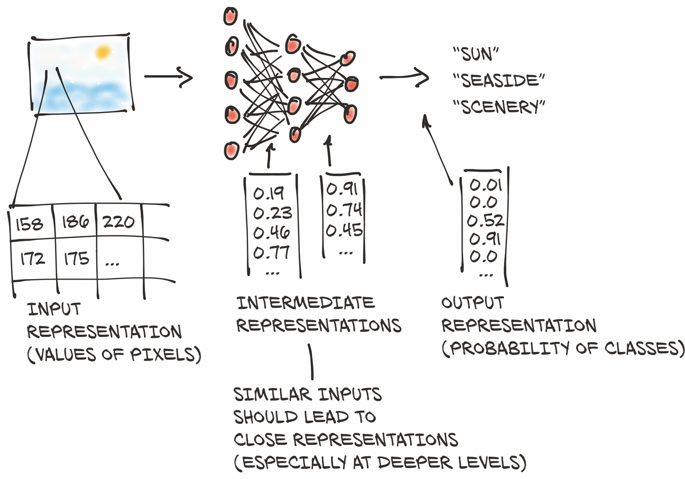
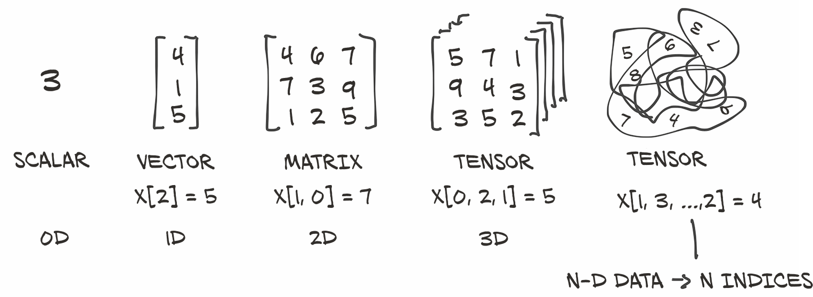
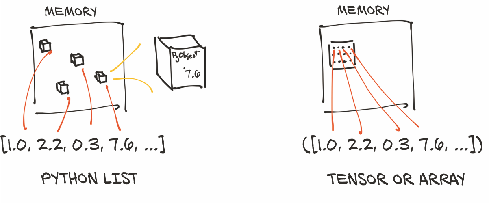
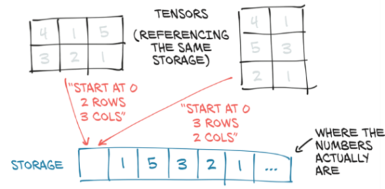
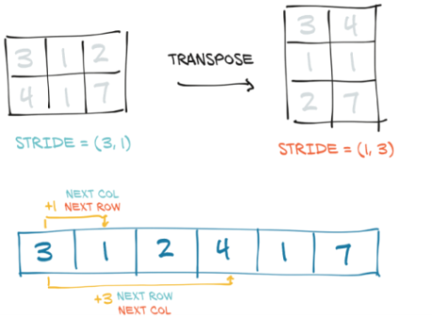
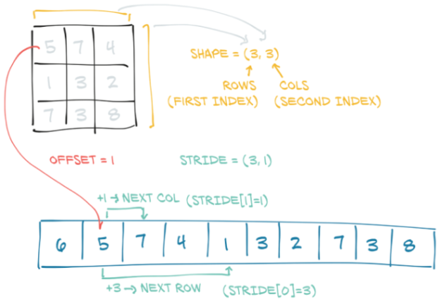

# <p align="right">3. 从张量开始</p>
***

>本章包括：  
&emsp;&emsp;- 理解张量--PyTorch中的基本数据结构  
&emsp;&emsp;- 张量的索引和运算  
&emsp;&emsp;- 与NumPy多维数组的交互操作  
&emsp;&emsp;- 将计算转移到GPU上以提高速度 

&emsp;&emsp;在上一章中，我们介绍了深度学习所实现的众多应用中的一部分。它们无一例外地包括获取某种形式的数据(如图像或文本)，并产生另一种形式的数据(如标签、数字或更多图像、文本)。从这个角度来看，深度学习其实就是构建一个能够将数据从一种表示形式转化为另一种表示形式的系统。这种转换是通过从一系列展示所需映射的例子中提取共性来驱动的。例如，系统可能会注意到狗的一般形状和金毛犬的典型颜色。通过结合这两种图像属性，系统可以将具有给定形状和颜色的图像正确地映射到**金毛犬**标签上，而不是**黑色的实验室**(或就此而言，黄褐色的山猫猫)。由此产生的系统可以消耗大量的类似输入，并为这些输入产生有意义的输出。

&emsp;&emsp;该过程首先将我们的输入转换为浮点数。我们将在第4章中介绍如何将图像像素转换为数字，如图3.1中的第一步所示(以及许多其他类型的数据)。但在这之前，在本章中，我们将学习如何在 PyTorch 中使用 **tensors (张量)** 来处理所有的浮点数。

## 3.1 <span id='chap3-1'>浮点数世界</span>

由于浮点数是网络处理信息的方式，我们需要一种方法将我们想要处理的现实世界的数据编码成网络可以消化的东西，然后将输出的数据解码成我们可以理解和使用的内容。

<center>图3.1 深度神经网络学习如何将输入表示转化为输出表示。(注：神经元和输出的数量不成比例。)</center>

<div align=center>

</div>

深度神经网络通常会分阶段学习从一种形式的数据到另一种形式的数据的转换，这意味着每个阶段之间的部分转换数据可以被认为是一系列中间表示。对于图像识别来说，早期的表示可以是边缘检测或某些纹理（如毛皮）等。更深层次的表示可以捕获更复杂的结构，如耳朵、鼻子或眼睛。

一般来说，这种中间表示是浮点数的集合，它对输入进行表征，并以一种有助于描述输入如何映射到神经网络的输出的方式来捕获数据的结构。这种表征是针对当前任务的，可以从相关示例中学习的。这些浮点数的集合及其操作是现代人工智能的核心--我们将在本书中看到几个这样的示例。

请务必牢记，这些中间表示（如图3.1第二步所示）是将输入与前一层神经元的权重相结合的结果。每个中间表示对于之前的输入都是唯一的。

在开始将数据转换为浮点输入之前，我们首先必须对PyTorch如何处理和存储数据--作为输入、中间表示和输出--有一些扎实的了解。本章将专门讨论这个问题。

为此，PyTorch引入了一个基本的数据结构：**tensor (张量)**。我们在第2章对预训练网络进行推理时，已经碰到了张量。对于那些来自数学、物理学或工程学的人来说，张量这个术语与空间、参照系以及它们之间的变换的概念捆绑在一起。无论好坏，这些概念在这里均不适用。在深度学习的上下文中，**张量是指向量和矩阵到任意维数的泛化**，如图3.2所示。这一概念的另一个名称是**multidimensional array (多维数组)**。张量的维数与用于引用张量内标量值的索引数一致。

<center>图3.2 张量是在PyTorch中表示数据的基础</center>

<div align=center>

</div>


PyTorch不是唯一处理多维数组的库。NumPy是迄今为止最受欢迎的多维数组库，可以说它现在已经成为数据科学的通用语言。PyTorch的特点是与NumPy的无缝互操作性，这为它带来了与Python中其他科学库的一流集成，比如SciPy (https://www.scipy.org) 、Scikit-Learning (https://scikit-learn.org) 和Pandas (https://pandas.pydata.org) 。

与NumPy数组相比，PyTorch张量具有一些超强的功能，例如能够在图形处理单元(GPU)上执行非常快速的操作、在多个设备或机器上分布式操作，以及跟踪创建它们的计算图的能力。这些都是实现现代深度学习库的重要功能。

在本章中，我们将介绍PyTorch张量，其中涵盖了它的相关基础知识，以便为本书其余部分的工作做准备。首先，我们将学习如何使用PyTorch张量库操纵张量。这包括诸如如何将数据存储在内存中，如何在固定时间内对任意大的张量执行某些操作以及前面提到的NumPy互操作性和GPU加速。如果要使张量成为我们编程工具箱中的首选工具，了解张量的功能和API是非常重要的。在下一章中，我们将充分利用这些知识，并学习如何以能够通过神经网络进行学习的方式表示几种不同类型的数据。

## 3.2 <span id='chap3-2'>张量：多维数组</span>

我们已经了解到，张量是PyTorch中的基本数据结构。 张量是一个数组：即一种存储数字集合的数据结构，这些数字可以使用索引单独访问，并且可以使用多个索引进行索引。

### 3.2.1 从Python列表到PyTorch张量

让我们看看列表索引的实际应用，这样我们就可以将其与张量索引进行比较。在Python中取一个包含三个数字的列表(.code/p1ch3/1_tensors.ipynb)：

```python
# In[1]:
a = [1.0, 2.0, 1.0]
```

我们可以使用对应的从零开始的索引来访问列表的第一个元素：

```python
# In[2]:
a[0]
 
# Out[2]:
1.0
 
# In[3]:
a[2] = 3.0
a
 
# Out[3]:
[1.0, 2.0, 3.0]
```

对于处理数字向量的简单 Python 程序来说，使用 Python 列表来存储向量是很常见的，比如二维线的坐标。正如我们将在下一章中所看到的，使用更有效的张量数据结构，可以表示许多类型的数据--从图像到时间序列，甚至是句子。通过定义张量上的操作(我们将在本章中探讨其中一些操作)，即使是使用高级（但不是特别快速）的语言（例如Python），我们也可以同时高效地切片和操作数据。

### 3.2.2 构建我们的第一个张量

让我们构造第一个PyTorch张量，并看看它的构造。它不必是一个特别有意义的张量，只需设置为包括三个1的列即可：

```python
# In[4]:
import torch
a = torch.ones(3)
a
 
# Out[4]:
tensor([1., 1., 1.])
 
# In[5]:
a[1]
 
# Out[5]:
tensor(1.)
 
# In[6]:
float(a[1])
 
# Out[6]:
1.0
 
# In[7]:
a[2] = 2.0
a
 
# Out[7]:
tensor([1., 1., 2.])
```

```python
其中，
# In[4]:
import torch       <------导入import模块
a = torch.ones(3)  <------创建尺寸为3且填充值为1的一维张量
...
...
```

导入`torch`模块后，我们调用一个函数来创建一个大小为3的（一维）张量，填充值为1.0。我们可以使用它从零开始的索引来访问一个元素，或者为其赋一个新值。虽然从表面上看，这个例子与数字对象的列表没有太大区别，但在本质上是完全不同的。

## 3.2.3 张量的本质

Python列表或数字元组是在内存中单独分配的Python对象的集合，如图 3.3 左侧所示。另一方面，PyTorch tensors或NumPy数组从视图上看，(通常)是分布在连续内存块上，包含有*unboxed C*数字类型(译者注：即不涉及指针或堆分配的类型)，而不是Python对象。在这种情况下，如图3.3右侧所示，每个元素都是一个32位(4 字节)的浮点数。这意味着存储1,000,000个浮点数的1D(一维)张量恰好需要4,000,000个连续的字节，外加元数据(如尺寸和数值类型)的少量开销。

<center>图3.3 Python对象(装箱)数值与张量(未装箱数组)数值的对比</center>

<div align=center>

</div>

假设我们有一个要用来表示几何对象的坐标列表：可能是一个顶点位于坐标(4，1)、(5，3)和(2，1)的2D三角形。这个例子与深度学习不是特别相关，但是很容易理解。我们可以使用一维张量，将X存储在偶数索引中，将Y存储在奇数索引中，而不是像我们前面所做的那样，在Python列表中将坐标作为数字，如下所示：

```python
# In[8]:
points = torch.zeros(6)
points[0] = 4.0
points[1] = 1.0
points[2] = 5.0
points[3] = 3.0
points[4] = 2.0
points[5] = 1.0
```

```python
其中，
# In[8]:
points = torch.zeros(6)  <-----使用.zeros只是一种获得合适尺寸数组的方法。
points[0] = 4.0          <-----我们用实际使用的值重写这些0
```

我们还可以将Python列表传递给构造函数，效果相同：

```python
# In[9]:
points = torch.tensor([4.0, 1.0, 5.0, 3.0, 2.0, 1.0])
points
 
# Out[9]:
tensor([4., 1., 5., 3., 2., 1.])
```

为了得到第一个点的坐标，我们做如下操作：

```python
# In[10]:
float(points[0]), float(points[1])
 
# Out[10]:
(4.0, 1.0)
```

这是可以的，尽管让第一个索引引用单个二维点而不是点坐标是可行的。为此，我们可以使用2D张量：

```python
# In[11]:
points = torch.tensor([[4.0, 1.0], [5.0, 3.0], [2.0, 1.0]])
points
 
# Out[11]:
tensor([[4., 1.],
        [5., 3.],
        [2., 1.]])
```

在这里，我们向构造函数传递一串列表。我们可以查询张量的形状：

```python
# In[12]:
points.shape
 
# Out[12]:
torch.Size([3, 2])
```

这让我们知道了张量在每个维度上的尺寸。我们也可以使用`zeros`或`ones`来初始化张量，以元组形式提供尺寸：

```python
# In[13]:
points = torch.zeros(3, 2)
points
 
# Out[13]:
tensor([[0., 0.],
        [0., 0.],
        [0., 0.]])
```

现在我们可以使用两个索引访问张量中的单个元素：

```python
# In[14]:
points = torch.tensor([[4.0, 1.0], [5.0, 3.0], [2.0, 1.0]])
points
 
# Out[14]:
tensor([[4., 1.],
        [5., 3.],
        [2., 1.]])
 
# In[15]:
points[0, 1]
 
# Out[15]:
tensor(1.)
```

这将返回我们数据集中第0个点的Y坐标。我们还可以像以前一样访问张量中的第一个元素，以获取第一个点的2D坐标：

```python
# In[16]:
points[0]
 
# Out[16]:
tensor([4., 1.])
```

输出的是另一个张量，它展示了同一基础数据的不同视图。新的张量是一个尺寸为2的1D张量，引用了`points`张量中第一行的值。这是否意味着分配了一个新的内存块，将值复制到其中，然后新的内存被包裹在一个新的张量对象中返回？不，因为这样的效率很低，尤其是当我们有数百万个点的时候。我们将在本章稍后的3.7节介绍张量的视图时，重新讨论张量的存储方式。

## 3.3 <span id='chap3-3'>索引张量</span>

如果我们需要获取一个除第一个点以外的所有点的张量怎么办呢？使用范围索引表示法很容易做到这一点，该表示法也适用于标准Python列表。提醒一下：

```python
# In[53]:
some_list = list(range(6))
some_list[:]
some_list[1:4]
some_list[1:]
some_list[:4]
some_list[:-1]
some_list[1:4:2]
```

```python
其中，
# In[53]:
some_list = list(range(6)) 
some_list[:]               <-----所有元素都在列表中
some_list[1:4]             <-----从元素1(含)到元素4(不含)
some_list[1:]              <-----从元素1(含)到列表的末尾
some_list[:4]              <-----从列表的开始到元素4(不含)
some_list[:-1]             <-----从列表的开始到最后一个元素的前一个
some_list[1:4:2]           <-----从元素1(含)到元素4(不含)，以2为步长
```


为了实现我们的目标，我们可以对PyTorch张量使用相同的表示法，还有额外的好处是，就像在 NumPy和其他Python科学库中一样，我们可以对张量的每个维度使用范围索引：


```python
# In[54]:
points[1:]
points[1:, :]
points[1:, 0]
points[None]
```

```python
其中，
# In[54]:
points[1:]          <-------第一行之后的所有行；隐式选择所有列
points[1:, :]       <-------第一行之后的所有行；所有列
points[1:, 0]       <-------第一行之后的所有行；第一列
points[None]        <-------增加一个尺寸为1的维度，就像unsqueeze一样
```
除了使用范围之外，PyTorch 还提供了一种强大的索引形式，称为**高级索引(advanced indexing)**，我们将在下一章中进一步探索。

## 3.4 <span id='chap3-4'>命名张量</span>


张量的维度（或轴）通常会对像素位置或颜色通道等进行索引。这意味着当我们要对一个张量进行索引时，我们需要记住维度的顺序，并据此相应地编写我们的索引。由于数据是通过多个张量进行转换的，因此跟踪哪个维度包含什么数据可能会容易出错。

具体来说，假设我们有一个3D张量，如2.1.4节中的`img_t`(为简单起见，我们这里将使用虚拟数据)，我们希望将其转换为灰度。我们查找颜色的典型权重以得出单个亮度值：[<sup>1</sup>](#jump3-1)

```python
# In[2]:
img_t = torch.randn(3, 5, 5) # shape [channels, rows, columns]
weights = torch.tensor([0.2126, 0.7152, 0.0722])
```

我们还通常希望代码能够泛化-例如，从表示为具有高度和宽度维度的2D张量的灰度图像到添加第三个通道维度的彩色图像（如RGB），或者从单张图像到一批图像。在2.1.4节中，我们在`batch_t`中引入了另一个批处理维度；在这里，我们假设有一个批处理维度设置为2：

```python
# In[3]:
batch_t = torch.randn(2, 3, 5, 5) # shape [batch, channels, rows, columns]
```

所以有时RGB通道在0维，有时在1维。但我们可以通过从末尾数起的方式来概括：它们总是在维度-3，即从末尾数起的第三个维度。因此，偷懒版的、未加权的平均数(mean)可以写成如下：

```python
# In[4]:
img_gray_naive = img_t.mean(-3)
batch_gray_naive = batch_t.mean(-3)
img_gray_naive.shape, batch_gray_naive.shape
 
# Out[4]:
(torch.Size([5, 5]), torch.Size([2, 5, 5]))
```

但现在我们加入了权重。PyTorch允许我们将形状(shape)相同的量相乘，或者将形状里一个操作数(one operand)在指定维度中为1的量相乘。它还会自动追加尺寸为1的leading dimensions(LDA)。形状为(2, 3, 5, 5)的 `batch_t` 乘以形状(3, 1, 1)的 `unsqueezed_weights`，得到形状(2, 3, 5, 5)的张量，然后我们可以从末端(三个通道)对第三个维度进行求和：

```python
# In[5]:
unsqueezed_weights = weights.unsqueeze(-1).unsqueeze_(-1)
img_weights = (img_t * unsqueezed_weights)
batch_weights = (batch_t * unsqueezed_weights)
img_gray_weighted = img_weights.sum(-3)
batch_gray_weighted = batch_weights.sum(-3)
batch_weights.shape, batch_t.shape, unsqueezed_weights.shape
 
# Out[5]:
(torch.Size([2, 3, 5, 5]), torch.Size([2, 3, 5, 5]), torch.Size([3, 1, 1]))
```

因为这样做变得杂乱无章--为了提高效率，PyTorch函数 `einsum` (改编自 NumPy) 指定了一种**索引迷你语言(indexing mini-language)**[<sup>2</sup>](#jump3-2)，为这些乘积的和提供了维度的索引名称。就像在Python中一样，广播 -- 一种总结未命名事物的形式 -- 是用三个点 '...'来完成的；但是不用太担心`einsum`，因为我们在下面内容中不会使用它：

```python
# In[6]:
img_gray_weighted_fancy = torch.einsum('...chw,c->...hw', img_t, weights)
batch_gray_weighted_fancy = torch.einsum('...chw,c->...hw', batch_t, weights)
batch_gray_weighted_fancy.shape
 
# Out[6]:
torch.Size([2, 5, 5])
```

正如我们所看到的，这涉及到相当多的记账工作(bookkeeping)。这很容易出错，特别是当我们的代码中创建和使用张量的位置相隔很远的时候。这已经引起了从业者的注意，因此有人建议给这个维度起个名字[<sup>3</sup>](#jump3-3)。

PyTorch 1.3 增加了命名张量作为实验性功能(请参见 https://pytorch.org/tutorials/intermediate/named_tensor_tutorial.html 和 https://pytorch.org/docs/stable/named_tensor.html) 。 张量的factory函数，如`tensor`和`rand`，需要一个`names`参数。`names`应该是一个字符串序列：

```python
# In[7]:
weights_named = torch.tensor([0.2126, 0.7152, 0.0722], names=['channels'])
weights_named
 
# Out[7]:
tensor([0.2126, 0.7152, 0.0722], names=('channels',))
```

当我们已经有了一个张量，并且想要添加名称（但不改变现有的名称）时，我们可以对它调用refine_names方法。与索引类似，省略号(...)允许你省略任意数量的维度。通过rename sibling方法，你也可以覆盖或删除（通过传递None）现有的名字。

当我们已经有了张量并想要添加名称（但不更改现有名称）时，可以在其上调用方法`fine_names`。 与索引类似，省略号（`...`）允许您省略任意数量的维度。通过`rename`同级(sibling)方法，您还可以覆盖或删除（通过传入`None`）现有名称：

```python
# In[8]:
img_named =  img_t.refine_names(..., 'channels', 'rows', 'columns')
batch_named = batch_t.refine_names(..., 'channels', 'rows', 'columns')
print("img named:", img_named.shape, img_named.names)
print("batch named:", batch_named.shape, batch_named.names)
 
# Out[8]:
img named: torch.Size([3, 5, 5]) ('channels', 'rows', 'columns')
batch named: torch.Size([2, 3, 5, 5]) (None, 'channels', 'rows', 'columns')
```

对于有两个输入的操作，除了常规的维度检查（即尺寸是否相同，或其中一个尺寸是否为1并可广播给另一个）之外，PyTorch现在还将为我们检查名称。到目前为止，它不会自动对齐维度，因此我们需要明确地进行此操作。`align_as`方法会返回一个添加了缺失维度的张量，并将现有的维度按正确的顺序排列：

```python
# In[9]:
weights_aligned = weights_named.align_as(img_named)
weights_aligned.shape, weights_aligned.names
 
# Out[9]:
(torch.Size([3, 1, 1]), ('channels', 'rows', 'columns'))
```

接受维度参数（例如`sum`）的函数也接受命名维度：

```python
# In[10]:
gray_named = (img_named * weights_aligned).sum('channels')
gray_named.shape, gray_named.names
 
# Out[10]:
(torch.Size([5, 5]), ('rows', 'columns'))
```

如果尝试将维度与不同的名称组合在一起，则会出现错误：

```python
gray_named = (img_named[..., :3] * weights_named).sum('channels')
 

 attempting to broadcast dims ['channels', 'rows',
  'columns'] and dims ['channels']: dim 'columns' and dim 'channels'
  are at the same position from the right but do not match.
```

如果要在对命名张量进行运算的函数之外使用该张量，则需要通过将名称重命名为`None`来删除名称。以下内容使我们回到了未命名维度的世界：

```python
# In[12]:
gray_plain = gray_named.rename(None)
gray_plain.shape, gray_plain.names
 
# Out[12]:
(torch.Size([5, 5]), (None, None))
```

在撰写本文时，考虑到该特性的实验性质，为了避免在索引和对齐方面浪费时间，我们将坚持在本书的其余部分使用未命名的张量。如果PyTorch论坛有任何指示的话，命名张量有可能消除许多对齐错误的来源(是个相当令人头疼的来源)。看看它们会被多大程度地采用会是一件有趣的事情。

## 3.5 <span id='chap3-5'>张量元素类型</span>

到目前为止，我们已经介绍了张量工作的基本原理，但是尚未涉及可以在张量中存储哪些数值类型。正如我们在3.2节中所提示的那样，使用标准Python数字类型可能不是最优的，原因有以下几种：

* Python中的**数字(Numbers)** 是 **对象(objects)**。例如，浮点数在计算机上可能只需要比32位来表示，而Python会将其转换为具有引用计数的完整Python对象。这种操作被称为**装箱(boxing)**。如果我们需要存储少量的数字，不成问题，但是分配数百万的量则效率很低。
* Python中的**列表(Lists)** 是为了对象的**顺序集合(sequential collections)**。没有定义两个向量的点积或向量求和的高效操作。而且，Python列表没有办法优化其内容在内存中的布局，因为它们是指向Python对象 (任何种类，而不仅仅是数字) 的指针的可索引集合。最后，Python列表是一维的，虽然我们可以创建列表的列表，但这同样也是非常低效的。
* 与优化、编译后的代码相比，Python**解释器**的速度很慢。对大量的数值数据集合进行数学运算，使用像C这样的可编译的低级语言编写的优化代码工作速度可以快得多。

由于这些原因，数据科学库依赖于NumPy或引入专用数据结构（例如PyTorch张量）。它提供了数值的数据结构和对其进行相关操作的高效低层次的实现，并包装在一个方便的高级API中。要实现这一点，张量内的对象必须全部是相同类型的数字，并且PyTorch必须跟踪此数字类型。


### 3.5.1 使用dtype指定数值类型

张量构造函数（也就是像`tensor`、`zeros`和`ones`这样的函数）的`dtype`参数指定了张量中包含的数值数据（d）类型。数据类型指定了张量可以容纳的值（整数与浮点数）和每个值的字节数。[<sup>4</sup>](#jump3-4) `dtype`参数有意类似于同名的标准NumPy参数。下面是`dtype`参数的可能值列表:

* torch.float32或torch.float：32位浮点
* torch.float64或torch.double：64位，双精度浮点
* torch.float16或torch.half：16位半精度浮点
* torch.int8：带符号的8位整数
* torch.uint8：无符号的8位整数
* torch.int16或torch.short：带符号的16位整数
* torch.int32或torch.int：带符号的32位整数
* torch.int64或torch.long：带符号的64位整数
* torch.bool：布尔值

张量的默认数据类型是32位浮点数。

### 3.5.2 适合各种场合的dtype

正如我们将在以后的章节中看到的那样，神经网络中发生的计算通常以32位浮点精度执行。 更高的精度（例如64位）并不能改善模型的准确性，并且需要更多的内存和计算时间。16位浮点半精度数据类型在标准CPU中并不存在，而在现代GPU上提供了这种类型。如果需要的话，可以切换到半精度以减少神经网络模型的占用空间，而对精度的影响很小。

张量可以用作其他张量的索引。在这种情况下，PyTorch期望索引张量具有64位整数数据类型。 创建一个以整数为参数的张量，例如使用torch.tensor（[2，2]），默认情况下将创建一个64位整数张量。 因此，我们将大部分时间用于处理float32和int64。


张量可以用作其他张量的索引。在本例中，PyTorch期望索引张量具有64位整数数据类型。默认情况下，使用整数作为参数创建张量(如使用`torch.tensor([2，2]`)将创建一个64位整数张量。因此，我们将把大部分时间用于处理`float32`和`int64`上。

最后，关于张量的断言（例如，`points > 1.0`）会产生表示每个单独元素是否满足条件的`bool`张量.简而言之，这些都是数字类型。

### 3.5.3 管理张量的dtype属性

为了分配正确数值类型的张量，我们可以将正确的数据类型指定为构造函数的参数。例如：

```python
# In[47]:
double_points = torch.ones(10, 2, dtype=torch.double)
short_points = torch.tensor([[1, 2], [3, 4]], dtype=torch.short)
```

我们可以通过访问相应的属性来了解张量的`dtype`：

```python
# In[48]:
short_points.dtype
 
# Out[48]:
torch.int16
```

我们还可以使用相应的强制转换方法将张量构造函数的输出强制转换为正确的类型，例如

```python
# In[49]:
double_points = torch.zeros(10, 2).double()
short_points = torch.ones(10, 2).short()
```

或更方便的方法`to`：

```python
# In[50]:
double_points = torch.zeros(10, 2).to(torch.double)
short_points = torch.ones(10, 2).to(dtype=torch.short)
```

在后台，`to`检查是否需要转换，如果需要，就进行转换。像`float`这样的`dtype命名`的强制转换方法是`to`的简写，但是`to`方法可以接受其他参数，我们将在3.9节中讨论这些。

在操作中混合输入不同类型时，输入将自动转换为较大的类型。因此，如果我们要进行32位计算，则需要确保所有输入（最多）是32位：

```python
# In[51]:
points_64 = torch.rand(5, dtype=torch.double)
points_short = points_64.to(torch.short)
points_64 * points_short  # works from PyTorch 1.3 onwards
 
# Out[51]:
tensor([0., 0., 0., 0., 0.], dtype=torch.float64)
```

```python
其中，
# In[51]:
points_64 = torch.rand(5, dtype=torch.double) <---rand将张量元素初始化为0到1之间的随机数。
...
...
```

## 3.6 <span id='chap3-6'>张量API</span>

至此，我们知道了什么是PyTorch张量，以及它们的工作原理。在我们结束之前，值得一看的是 PyTorch提供的张量操作。在这里列出所有的操作是没有什么用处的。相反，我们将对API有一个大致的了解，并就如何在 http://pytorch.org/docs 的在线文档中找到相关内容提供一些指导。

首先，绝大多数关于张量和张量之间的操作都可以在 `torch` 模块中找到，也可以作为张量对象的方法来调用。例如，我们前面遇到的`transpose`函数就可以在 `torch` 模块中调用：

```python
# In[71]:
a = torch.ones(3, 2)
a_t = torch.transpose(a, 0, 1)
 
a.shape, a_t.shape
 
# Out[71]:
(torch.Size([3, 2]), torch.Size([2, 3]))
```

或者作为张量`a`的方法被调用：

```python
# In[72]:
a = torch.ones(3, 2)
a_t = a.transpose(0, 1)
 
a.shape, a_t.shape
 
# Out[72]:
(torch.Size([3, 2]), torch.Size([2, 3]))
```

这两种形式没有区别，可以互换使用。

我们前面提到了在线文档（http://pytorch.org/docs)。它们非常详尽，而且条理清晰，张量操作被分成了几组：

* **创建操作(Creation ops)** --构造张量的函数，比如 `ones` 和 `from_numpy`
* **索引、切片、连接、转换操作(indexing, slicing, joining, mutating ops)** --改变张量的形状、步长或内容的函数，如`transpose`。
* **数学运算(Math ops)**--通过计算来操作张量内容的函数。
    - 逐点运算(Pointwise ops)--通过将函数独立地应用于每个元素来获得新张量的函数，如`abs`和`cos`
    - 归约运算(Reduction ops)--通过遍历张量计算聚合值的函数，如`mean`, `std`, 和`norm`
    - 比较运算(Comparison ops)--用于评估张量中数字关系断言的函数，如`equal`和`max`
    - 频谱运算(Spectral ops)--变换到频域并在频域中运算的函数，如`stft`和`hamming_window`
    - 其他运算(Other operations)--对向量(如`cross`)或矩阵(如`trace`)进行运算的特殊函数。
    - BLAS和LAPACK运算--遵循基本线性代数子程序（BLAS）规范的函数，用于标量，矢量-矢量，矩阵-矢量和矩阵-矩阵运算
* **随机抽样(Random sampling)**--通过从概率分布中随机抽取来生成值的函数，如`randn`和`normal`
* **序列化(Serialization)**--保存和加载张量的函数，如`load`和`save`
* **并行化(Parallelism)**--用于控制并行CPU执行的线程数量的函数，如`set_num_thread`

花一些时间来使用常规的张量API。本章提供了启用这种交互式探索的所有先决条件。从下一章开始，我们还将在本书中遇到一些张量运算。

## 3.7 <span id='chap3-7'>张量：对存储的图形化</span>

现在是时候让我们更仔细地看看代码的实现了。张量中的值被分配在由`torch.Storage`实例管理的连续内存块中。一个storage一个由数字数据组成的一维数组：即包含给定类型数字的连续内存块，例如 `float`（32 位代表浮点数）或 `int64`（64 位代表整数）。PyTorch当中 `Tensor` 实例就是这样一个存储(`torage`)实例的体现，它能够使用偏移量和每个维度的步长(stride)来索引到该存储。[<sup>5</sup>](#jump3-5)

<center>图3.4 Tensors是Storage实例的视图</center>

<div align=center>

</div>

多个张量可以索引同一存储，即使它们对数据的索引并不相同。我们可以在图3.4中看到一个示例。实际上，当我们在3.2节中请求`points[0]`时，我们得到的是以`points`张量保存的同一存储空间——不是它的全部，并是具有不同的维度（1D与2D）。但是，基础内存仅分配一次，因此，无论`Storage`实例管理的数据大小如何，都可以快速完成对数据的备用张量视图的创建。

### 3.7.1 索引到存储

让我们看看在2D点中实际上如何建立存储索引。 使用`.storage`属性可以访问给定张量的存储：
```python
# In[17]:
points = torch.tensor([[4.0, 1.0], [5.0, 3.0], [2.0, 1.0]])
points.storage()
 
# Out[17]:
 4.0
 1.0
 5.0
 3.0
 2.0
 1.0
[torch.FloatStorage of size 6]
```
尽管张量报告自己有三行两列，但它下面的存储是一个大小为6的连续数组。在这个意义上，张量只知道如何将一对索引转换为存储中的某个位置。。

我们也可以手动索引到一个存储。例如：
```python
# In[18]:
points_storage = points.storage()
points_storage[0]
 
# Out[18]:
4.0
 
# In[19]:
points.storage()[1]
 
# Out[19]:
1.0
```
我们不能用两个索引来索引一个二维张量的存储。一个存储的布局总是一维的，不管可能引用它的任何和所有张量的维度如何。

在这一点上，更改存储的值会导致更改其引用张量的内容不足为奇：
```python
# In[20]:
points = torch.tensor([[4.0, 1.0], [5.0, 3.0], [2.0, 1.0]])
points_storage = points.storage()
points_storage[0] = 2.0
points
 
# Out[20]:
tensor([[2., 1.],
        [5., 3.],
        [2., 1.]])
```
### 3.7.2 修改存储的值：就地操作（In-place operations)

除了上一节介绍的对张量的操作外，还有少量的操作只作为`Tensor`对象的方法存在。它们可以通过名称中的下划线来识别，比如`zero_`，它表示该方法通过**就地(in-place)修改**输入而不是创建一个新的输出张量并返回它。例如，`zero_`方法将输入的所有元素置为零。任何**没有**尾部下划线的方法都不会改变源张量，而是返回一个新的张量：

```python
# In[73]:
a = torch.ones(3, 2)
 
# In[74]:
a.zero_()
a
 
# Out[74]:
tensor([[0., 0.],
        [0., 0.],
        [0., 0.]])
```

## 3.8 <span id='chap3-8'>张量元数据：大小(size)、偏移(offset)和步长(stride)</span>

为了索引存储(storage)，张量依赖于几条信息以及它们的存储，明确地定义它们：大小(size)、偏移(offset)和步长(stride)。这些信息相互作用的方式如图3.5所示。大小（或形状shape，以NumPy的说法）是一个元组(tuple)，指示张量表示的每个维度上有多少个元素。存储的偏移是与张量中的第一个元素相对应的存储中的索引。步长是存储中需要跳过的元素数量，以便沿每个维度获取下一个元素。

<center>图3.5 张量的偏移，大小和步长之间的关系。张量在这里是较大存储的视图，就像在创建较大张量时可能已分配的存储那样</center>

<div align=center>

</div>

### 3.8.1 另一个张量的存储视图

我们可以通过提供相应的索引来获得张量中的第二个点：

```python
# In[21]:
points = torch.tensor([[4.0, 1.0], [5.0, 3.0], [2.0, 1.0]])
second_point = points[1]
second_point.storage_offset()
 
# Out[21]:
2
 
# In[22]:
second_point.size()
 
# Out[22]:
torch.Size([2])
```

生成的张量在存储中的偏移为2（因为我们需要跳过第一个点，它有两项），并且由于张量是一维的，size是一个包含一个元素的`Size`类的实例。需要注意的是，这与张量对象`shape`属性中包含的信息相同:
```python
# In[23]:
second_point.shape
 
# Out[23]:
torch.Size([2])
```

stride是一个元组，表示当索引在每个维度上增加1时必须跳过的存储元素的数量。例如，我们的`points`张量的步长为`(2，1)`:
```python
# In[24]:
points.stride()
 
# Out[24]:
(2, 1)
```

在2D张量中访问元素`i，j`的结果是访问存储器中的`storage_offset + stride [0] * i + stride [1] * j`元素。偏移通常为零；如果此张量是为容纳更大张量而创建的存储的视图，则偏移量可能为正值。

`Tensor`和`Storage`之间的这种间接性使得一些操作的开销变得很低，比如转置张量或提取子张量，因为它们不会导致内存重新分配。取而代之的是，它们会分配一个新的包括不同大小、存储偏移量或步长的`Tensor`对象。

当我们索引特定点并看到存储偏移量增加时，我们已经提取了一个子张量。让我们来看看大小和步长是如何变化的：

```python
# In[25]:
second_point = points[1]
second_point.size()
 
# Out[25]:
torch.Size([2])
 
# In[26]:
second_point.storage_offset()
 
# Out[26]:
2
 
# In[27]:
second_point.stride()
 
# Out[27]:
(1,)
```

下面的代码则是，如我们所期望的那样，子张量具有较小的维度，同时仍索引与原始的`points`张量相同的存储。这也意味着更改子张量将对原始张量产生副作用：

```python
# In[28]:
points = torch.tensor([[4.0, 1.0], [5.0, 3.0], [2.0, 1.0]])
second_point = points[1]
second_point[0] = 10.0
points
 
# Out[28]:
tensor([[ 4.,  1.],
        [10.,  3.],
        [ 2.,  1.]])
```

这种操作可能并不是我们想要的，因此可以选择拷贝子张量的值到一份新的张量里面去：

```python
# In[29]:
points = torch.tensor([[4.0, 1.0], [5.0, 3.0], [2.0, 1.0]])
second_point = points[1].clone()
second_point[0] = 10.0
points
 
# Out[29]:
tensor([[4., 1.],
        [5., 3.],
        [2., 1.]])
```

### 3.8.2 无需复制的转置

现在我们来试试转置。让我们采用`points`张量，它在行中有单独的点，在列中有对应的X和Y坐标，将他转置，使单个点换到列中。我们借此机会介绍一下`t`函数，它是二维张量转置的速记替代方法：

```python
# In[30]:
points = torch.tensor([[4.0, 1.0], [5.0, 3.0], [2.0, 1.0]])
points
 
# Out[30]:
tensor([[4., 1.],
        [5., 3.],
        [2., 1.]])
 
# In[31]:
points_t = points.t()
points_t
 
# Out[31]:
tensor([[4., 5., 2.],
        [1., 3., 1.]])
```

> 贴士：为了帮助您更好地理解张量的原理，当我们在本节中学习代码时，不妨拿起一支铅笔和一张纸，在图3.5中这样的图表上涂鸦。

我们可以轻松地验证两个张量共享相同的存储：

```python
# In[32]:
id(points.storage()) == id(points_t.storage())
 
# Out[32]:
True
```

而它们的区别只在于形状和步长：

```python
# In[33]:
points.stride()
 
# Out[33]:
(2, 1)
# In[34]:
points_t.stride()
 
# Out[34]:
(1, 2)
```
这告诉我们，以点为单位增加第一个索引--例如，从点[0,0]到点[1,0]--将沿存储跳过两个元素，而增加第二个索引--从点[0,0]到点[0,1]--将沿存储跳过一个。换句话说，存储空间按顺序逐行存放张量中的元素。

这告诉我们，在`points`中的第一个索引增加1，例如，从`points[0,0]`到`points[1,0]`--将沿着存储跳过两个元素，而增加第二个索引：从`points[0,0]`到`points[0,1]`--将沿存储跳过1一个元素。换句话说，存储空间按顺序逐行存放张量中的元素。


我们可以将`points`转置为`points_t`，如图3.6所示。我们先改变步长中元素的顺序。之后，增加行（张量的第一个索引）将沿存储空间跳过一个元素，就像我们沿`points`的列移动时一样。这就是转置的定义。没有分配新的内存：仅通过创建步长顺序与原始顺序不同的新`Tensor`实例来获得转置。

<center>图3.6 对张量进行转置操作</center>

<div align=center>

</div>

### 3.8.3 在更高的维度上进行转置

PyTorch中的转置不仅限于矩阵。我们可以通过指定两个维度来进行多维数组的转置（翻转形状和步长）：

```python
# In[35]:
some_t = torch.ones(3, 4, 5)
transpose_t = some_t.transpose(0, 2)
some_t.shape
 
# Out[35]:
torch.Size([3, 4, 5])
 
# In[36]:
transpose_t.shape
 
# Out[36]:
torch.Size([5, 4, 3])
 
# In[37]:
some_t.stride()
 
# Out[37]:
(20, 5, 1)
 
# In[38]:
transpose_t.stride()
 
# Out[38]:
(1, 5, 20)
```

一个张量的值在存储中从最右边的维度开始排列（也就是说，对于一个二维张量来说，沿着行移动）被定义为连续(`contiguous`)的。连续张量很方便，因为我们可以按顺序高效访问它们，而不需要在存储中跳来跳去（由于现代CPU上的内存访问方式，提高数据的位置性可以提高性能）。当然，这个优势取决于算法的访问方式：

### 3.8.4 连续张量（contiguous tensors）

PyTorch 中的一些张量操作只适用于连续的张量，例如我们将在下一章中遇到的`view`。在这种情况下，PyTorch会抛出一个信息异常，并要求我们显式调用`contiguous`。值得注意的是，如果张量已经是连续的，那么调用`contiguous`不会有任何作用（也不会影响性能）。

在我们的例子中，`points`是连续的，而它的转置不是：

```python
# In[39]:
points.is_contiguous()
 
# Out[39]:
True
 
# In[40]:
points_t.is_contiguous()
 
# Out[40]:
False
```

我们可以用`contiguous`方法从一个非连续的张量中得到一个新的连续张量。张量的内容不变，但步长会改变，存储也会改变：

```python
# In[41]:
points = torch.tensor([[4.0, 1.0], [5.0, 3.0], [2.0, 1.0]])
points_t = points.t()
points_t
 
# Out[41]:
tensor([[4., 5., 2.],
        [1., 3., 1.]])
 
# In[42]:
points_t.storage()
 
# Out[42]:
 4.0
 1.0
 5.0
 3.0
 2.0
 1.0
[torch.FloatStorage of size 6]
 
# In[43]:
points_t.stride()
 
# Out[43]:
(1, 2)
 
# In[44]:
points_t_cont = points_t.contiguous()
points_t_cont
 
# Out[44]:
tensor([[4., 5., 2.],
        [1., 3., 1.]])
 
# In[45]:
points_t_cont.stride()
 
# Out[45]:
(3, 1)
 
# In[46]:
points_t_cont.storage()
 
# Out[46]:
 4.0
 5.0
 2.0
 1.0
 3.0
 1.0
[torch.FloatStorage of size 6]
```

请注意，现在已经对存储进行了reshuffled操作，以便在新存储中逐行布置元素。步长已更改以反映新的存储布局。

作为回顾，图3.7再次显示了我们的图。希望现在，我们已经对张量的构建方式有了很好的了解。

<center>图3.7 张量的偏移，大小和步长之间的关系。张量在这里是较大存储的视图，就像在创建较大张量时可能已分配的存储那样</center>

<div align=center>

</div>

## 3.9 <span id='chap3-9'>移动张量至GPU</span>

到目前为止，在本章中，当我们谈论存储时，是指CPU上的内存。 PyTorch张量也可以存储在另一种处理器上：图形处理单元（GPU）。每个PyTorch张量都可以传输到GPU中，以便执行大规模的并行快速计算。对张量进行的所有操作都将使用PyTorch附带的GPU专用例程来执行。


## 3.10 <span id='chap3-10'>NumPy互操作性</span>
## 3.11 <span id='chap3-11'>广义张量也是张量</span>
## 3.12 <span id='chap3-12'>序列化张量</span>
## 3.13 <span id='chap3-13'>结论</span>
## 3.14 <span id='chap3-14'>练习</span>
## 3.15 <span id='chap3-15'>小结</span>

---

<span id = "jump3-1"><sup>1</sup></span> 由于感知并非毫无意义，人们提出了许多衡量的标准。例如，请参见：https://en.wikipedia.org/wiki/Luma_(video) .

<span id = "jump3-2"><sup>2</sup></span> 蒂姆·罗克塔舍尔(TimRocktäschel)的博客文章“Einsum is All You Need—Einstein Summation in Deep Learning” (https://rockt.github.io/2018/04/30/einsum) 提供了很好的概述。

<span id = "jump3-3"><sup>3</sup></span> See Sasha Rush, “Tensor Considered Harmful,” Harvardnlp, http://nlp.seas.harvard.edu/NamedTensor.

<span id = "jump3-4"><sup>4</sup></span>

<span id = "jump3-5"><sup>5</sup></span>